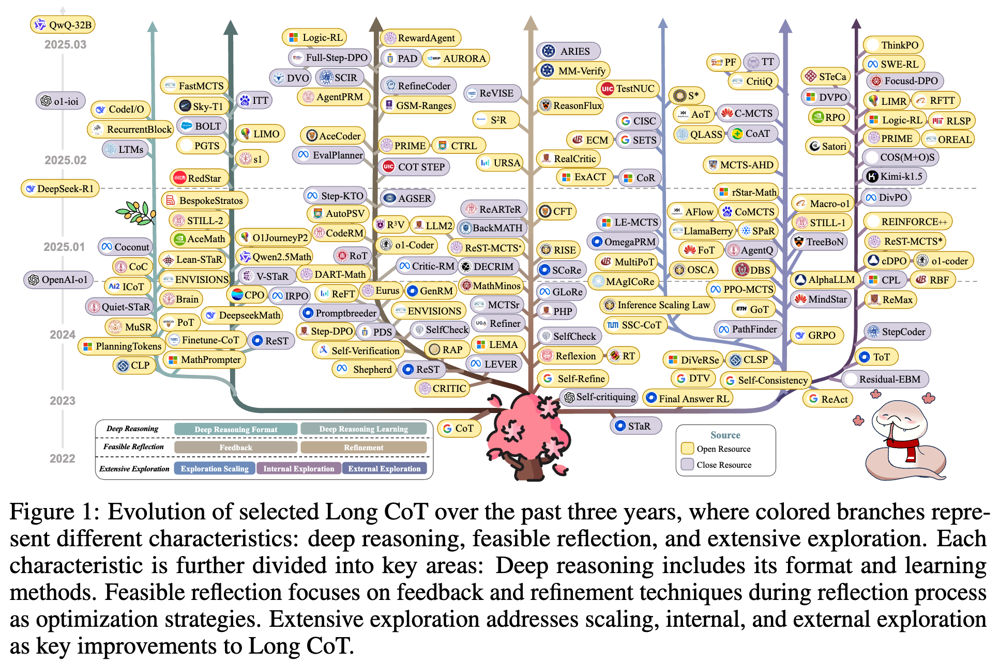
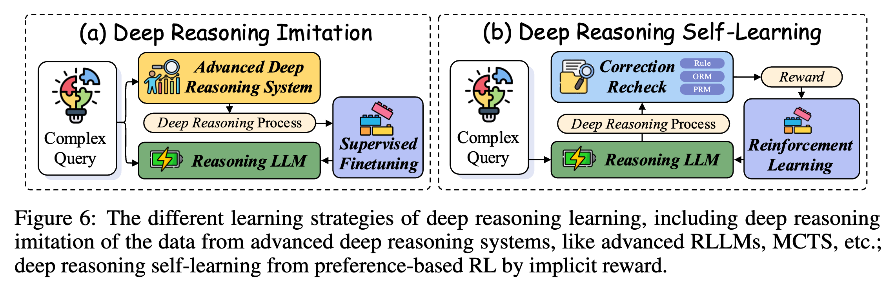
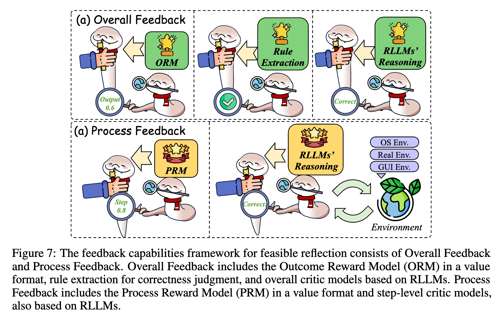
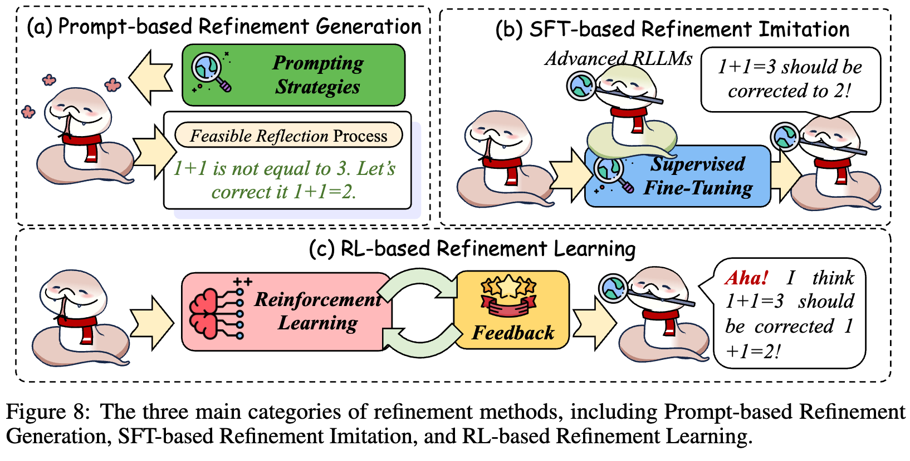
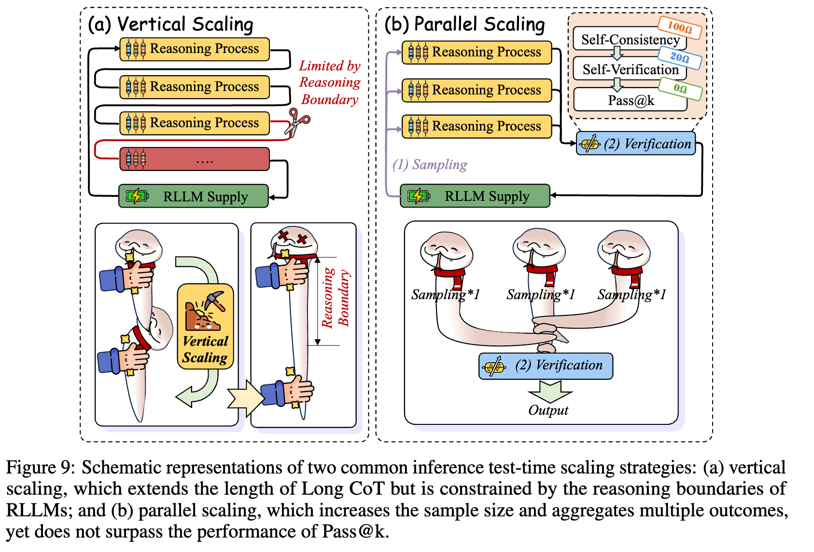
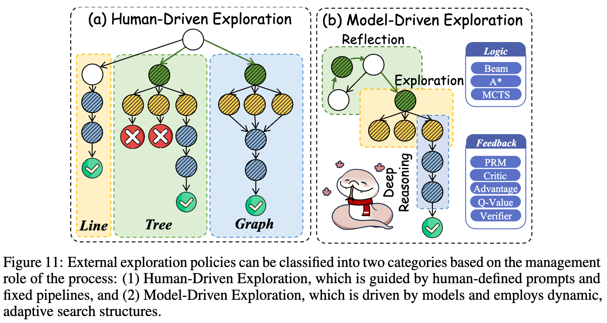
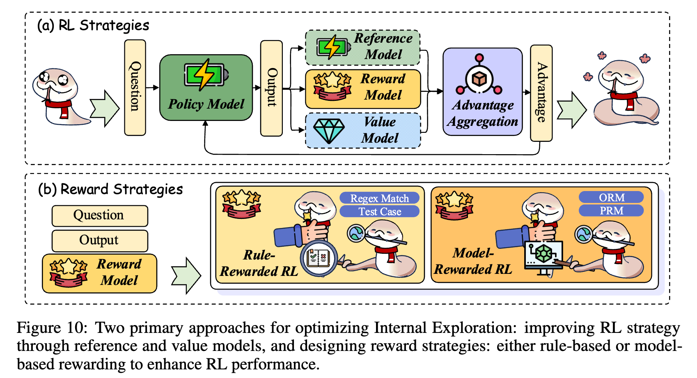
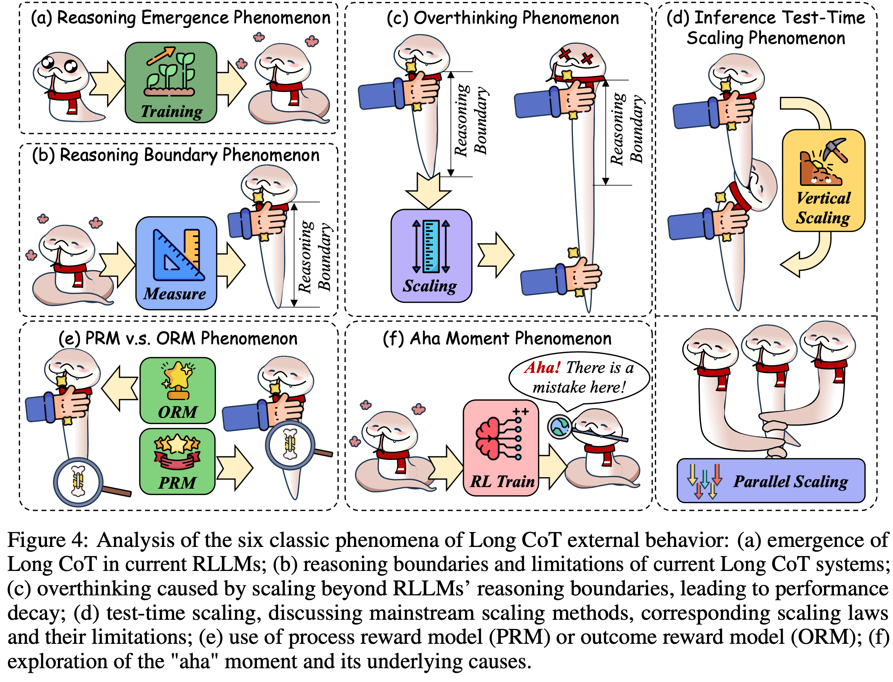

#  Awesome-Long-Chain-of-Thought-Reasoning


[](https://arxiv.org/pdf/2503.09567) 
[](https://github.com//LightChen233/Awesome-Long-Chain-of-Thought-Reasoning)
[](https://github.com/LightChen233/Awesome-Long-Chain-of-Thought-Reasoning)
[]()

\[[中文教程](README-zh.md)\] / \[[English Tutorial](README.md)\]


<!-- omit in toc -->
# 🔥 更新
- **2025.07**: 🎉🎉🎉  我们将综述的论文数量更新至超过1000篇。此外，我们还优化了本代码库，添加了双语部分，使其更加适合Long-CoT初学者使用。
- **2025.04**: 🎉🎉🎉  我们已将综述的论文数量更新至超过900篇。此外，我们增强了展示效果，添加了更具吸引力的展示图。
- **2025.03**: 🎉🎉🎉 我们发布了一篇题为 "[Towards Reasoning Era: A Survey of Long Chain-of-Thought for Reasoning Large Language Models](https://arxiv.org/pdf/2503.09567)"的综述论文。欢迎引用或提交pull request，分享您的精彩研究。

<!-- omit in toc -->
# 🌟 简介

欢迎来到与我们综述论文《Towards Reasoning Era: A Survey of Long Chain-of-Thought for Reasoning Large Language Models》相关的代码库。该代码库包含了与我们正在进行的长链推理（Long CoT）研究相关的**资源和更新**。详细介绍请参阅我们的 [综述论文](https://arxiv.org/pdf/2503.09567).

近年来，OpenAI-O1和DeepSeek-R1等大型语言模型在推理任务中的最新进展，展示了它们在数学、编程等复杂领域中的卓越能力。它们成功的关键因素之一是应用了长思维链（Long CoT）特性，这些特性增强了推理能力，并使得解决复杂问题成为可能。



然而，尽管有这些进展，关于长思维链的综合性调查仍然缺乏，这限制了我们对其与传统短思维链（Short CoT）之间区别的理解，并使得在诸如“过度思考”和“测试时扩展性”等问题上的争论变得更加复杂。本调查旨在填补这一空白，通过提供一个统一的视角来探讨长思维链。具体来说: 
1. 我们首先区分了长思维链和短思维链，并引入了一种新的分类法来对当前的推理范式进行分类。
2. 接着，我们探讨了长思维链的关键特征: 深度推理、广泛探索和可行的反思，这些特征使得模型能够处理更复杂的任务，并且与较浅的短思维链相比，产生更高效、更连贯的结果。
3. 然后，我们研究了长思维链出现的关键现象，例如过度思考和测试时扩展性，提供了这些过程在实践中如何表现的见解。
4. 最后，我们识别了重要的研究空白，并突出了有前景的未来研究方向，包括多模态推理的整合、效率提升以及知识框架的增强。

通过提供一个结构化的概览，本调查旨在激发未来的研究，推动人工智能推理能力的发展。


<!-- omit in toc -->


# 🕹️ 具体内容
## 0. 如何学习 \& 关于我们
我们希望的是帮助新人快速建立领域认知, 所以设计理念是: 简要介绍目前推理大模型与长思维链涉及到的主要技术, 让大家知道不同的技术能够解决什么问题, 未来想要深入发展的时候能够有头绪。

我们是一个由推理大模型初学者组成的团队, 希望能够通过我们自己的学习经验, 为后来者提供一些帮助, 加快推理大模型的普及和应用。欢迎更多朋友加入我们的项目, 也很欢迎交友、学术合作, 有任何问题, 可以联系邮箱 [charleschen2333@gmail.com](mailto:charleschen2333@gmail.com)。

**日常知识储备**
- **社交媒体:**
  - 可以关注的微信公众号: 机器之心, 新智元, 量子位, Paper Weekly, MLNLP...
  - 可以关注的Twitter: [AK](https://x.com/_akhaliq), [elvis](https://x.com/omarsar0), [Philipp Schmid](https://x.com/_philschmid), ...
- **前沿课程:** [CS336](https://stanford-cs336.github.io/spring2025/)
- **社区分享:** [MLNLP](https://space.bilibili.com/168887299), [机器之心官方](https://space.bilibili.com/73414544), [智源社区](https://hub.baai.ac.cn/), [NICE学术](https://space.bilibili.com/507524288)

## 1. 经典的Reasoning Model
- [OpenAI-o1 / o3 / o4](https://platform.openai.com/docs/models/#o3): 最早探索长思维链的推理模型，OpenAI开发的第一梯队的模型。
- [Gemini](https://github.com/google-gemini): Google开发第一梯队的模型。
- [Deepseek-r1](https://github.com/deepseek-ai/DeepSeek-R1): 最早开源的大规模长思维链推理模型。
- [QwQ](https://qwenlm.github.io/zh/blog/qwq-32b-preview/): 最早开源的长思维链推理模型。
- [Qwen3](https://github.com/QwenLM/Qwen3): 最常用的阿里开源的长思维链的推理系列模型。
- [Seed-Thinking-v1.5](https://github.com/ByteDance-Seed/Seed-Thinking-v1.5/blob/main/seed-thinking-v1.5.pdf): 字节开源的长思维链的推理模型。
- [Kimi-k1.5](https://github.com/MoonshotAI/Kimi-k1.5): Moonshoot开发的最早的多模态长思维链的推理模型。
- [MiniMax-m1](https://github.com/MiniMax-AI/MiniMax-M1): MiniMax开发的开源长思维链的推理模型。


## 2. Long-CoT的能力介绍
在本章中，我们会提供每个能力最代表性的技术和最新的一些发展，详细的论文列表见 [完整列表](pages/paper.md)。


### 2.1 深度推理（Deep Reasoning）

深度推理能力的核心在于需要足够的逻辑处理深度来管理大量推理节点。若缺乏此类能力，推理大模型（RLLMs）的性能会出现显著下降。当前提升深度推理的方法可分为两大类: 深度推理形式（Deep Reasoning Format），深度推理学习（Deep Reasoning Learning）。



#### 2.1.1 深度推理形式（Deep Reasoning Format）
由于推理模型往往极度依赖推理的形式，模型往往会在他擅长的表述方式上获得最深的推理路径，为此，一些工作开始探索用更好的推理形式进行更深入的推理。


---

**自然语言深度推理（Natural Language Deep Reasoning）**

- **核心思想:** 旨在通过自然语言格式来表述深度推理。
- **代表工作:**
  - [Natural Program](https://proceedings.neurips.cc/paper_files/paper/2023/file/72393bd47a35f5b3bee4c609e7bba733-Paper-Conference.pdf): 框架确保更结构化、更严密的逻辑分析。
  - [Code I/O](https://arxiv.org/abs/2502.07316): 将基于代码的推理模式重组为自然语言形式，进一步释放RLLMs的推理潜力。

---

**结构化语言深度推理（Structured Language Deep Reasoning）**

- **核心思想:** 旨在通过程序化或符号化语言格式来增强深度推理，当前大多数研究集中于利用代码提升数学推理能力。
- **代表工作:**
  - [Program-of-Thought](https://openreview.net/forum?id=YfZ4ZPt8zd): 让模型用代码语言进行思考，从而获得更好的推理能力。
  - [DeepSeek-Prover](https://arxiv.org/abs/2405.14333): 将自然语言问题转化为形式化语句，过滤掉低质量语句，并生成证明以创建合成数据，增强LLM的定理证明能力。
  - [RBF](https://proceedings.neurips.cc/paper_files/paper/2024/hash/62ab1c2cb4b03e717005479efb211841-Abstract-Conference.html): 证明了为什么在强规划需求的场景下，结构化语言会比自然语言更好。

---

**隐空间深度推理（Latent Space Deep Reasoning）**

- **核心思想:** 通过连续隐空间操作增强LLM推理能力。
- **代表工作:**
  1. **Token驱动:** 早期研究提出隐式"规划Token"或"思维Token"概念，用于引导隐空间内的推理过程。
     - [Coconut（连续思维链）](https://arxiv.org/abs/2412.06769): 进一步通过维护多条并行推理路径扩展该方法，在提升复杂度的同时保证效率；
     - [Heima](https://arxiv.org/abs/2501.19201) 框架通过潜在隐藏空间进行高效推理，创新性地将整个长思维链过程压缩至单一Token，实现显著的计算资源节约。
  2. **向量驱动（Vector Driven）:** 插入一个额外的向量，用于引导隐空间内的推理过程。
     - [隐思维语言模型（LTMs）](https://arxiv.org/abs/2502.01567): 前瞻性地将LLM各层抽象为"思维块"，并为每层引入"思维向量"概念。通过隐空间中的循环深度计算，实现测试阶段计算量的动态缩放。
  3. **管理器驱动（Manager Driven）:** 提出连续管理器的机制，来管理隐空间状态
     - [Recurrent Block](https://arxiv.org/abs/2502.05171): 通过迭代控制训练好的"循环块"作为递归"思维块"，在推理时整合更深模型层，无需专用训练数据即可提升性能。
     - [内隐思维Transformer（ITT）](https://arxiv.org/abs/2502.13842): 利用原始Transformer层作为递归"思维块"，通过自适应Token路由选择关键Token，采用残差思维连接控制推理深度，实现对关键Token的高效处理。
- **相关仓库:**
  - [Awesome-Latent-CoT](https://github.com/EIT-NLP/Awesome-Latent-CoT): 提供了更丰富的思维链表征的综述调查，包括潜在空间，捕捉了单独语言无法表达的复杂的非语言思想。

---

#### 2.1.2 深度推理学习（Deep Reasoning Learning）

推理大模型中深度推理能力的不足会显著降低模型性能。为此，学界聚焦于通过训练提升推理能力。指令微调（SFT）作为记忆过程可稳定模型输出，而强化学习（RL）则能实现泛化与自我学习。

---

**深度推理模仿（Deep Reasoning Imitation）**

- **核心思想:** 通过模仿先进推理系统，可有效实现RLLMs的深度推理，使模型能学习复杂推理模式并实现跨任务泛化。
- **代表工作:**
  1. **人类推理模仿**
     - [GSM8K/GPT-Verifier](https://arxiv.org/abs/2110.14168): 较早地提出基于人类标注的深度推理样本，进行模仿学习。
     - [ALT](https://proceedings.neurips.cc/paper_files/paper/2024/file/8678da90126aa58326b2fc0254b33a8c-Paper-Conference.pdf): 通过生成大规模人工标注逻辑模板数据集提升RLLMs推理深度。
  2. **高阶RLLMs模仿**
     - [AceMath](https://arxiv.org/abs/2412.15084): 采用少样本提示从先进LLMs蒸馏长思维链样本，通过多阶段质量引导SFT提升性能。
     - [DART-Math](https://proceedings.neurips.cc/paper_files/paper/2024/file/0ef1afa0daa888d695dcd5e9513bafa3-Paper-Conference.pdf): 在合成阶段有效蒸馏需根据难度进行深度推理样本的拒绝采样。
     - [OpenThoughts](https://arxiv.org/abs/2506.04178) / [OpenCodeReasoning](https://arxiv.org/abs/2504.01943) / [NaturalThoughts](https://arxiv.org/abs/2507.01921): 将该范式扩展至数学、代码乃至通用场景。
  3. **扩展增强的RLLMs模仿**
     - [Bansal等人](https://openreview.net/forum?id=HuYSURUxs2): 发现可以通过扩大采样规模和长度提升数据质量。
     - [Qwen-Math](https://arxiv.org/abs/2409.12122) / [PromptCoT](https://arxiv.org/abs/2503.02324): 进一步结合扩展采样与奖励模型样本选择，生成奥林匹克级别难度的深度推理样本。
     - [FastMCTS](https://arxiv.org/abs/2502.11476): 利用蒙特卡洛树搜索（MCTS）识别最优深度推理路径。
- **最新进展:**
     - [Journey P2](https://arxiv.org/abs/2411.16489): 从o1、R1等先进RLLM API蒸馏知识可显著提升小型LLMs性能，其监督微调方法在复杂数学推理任务上甚至超越教师模型。
     - [s1](https://arxiv.org/abs/2501.19393) / [LIMO](https://arxiv.org/abs/2502.03387): 少量高质量样本即可激活基础LLMs的深度推理能力。

---

**深度推理自学习（Deep Reasoning Self-Learning）**

- **核心思想:** 尽管简单模仿即可获得优异性能，当前模型在模仿与蒸馏过程中仍高度依赖人工标注或高阶模型输出。为突破这一局限，研究聚焦于自学习（self-learning）等技术实现更高级的推理能力。根据采样策略差异，自学习方法可分为两大范式: 
- **代表工作:**
  1. **直接采样进行自我学习（Self-Learning from Direct Sampling）**
     - [STaR](https://arxiv.org/abs/2203.14465): 利用上下文学习（ICL）对深度推理结果进行采样，以最终答案的正确性作为自学习的隐式奖励。
     - [Reinforced Self-Training (ReST)](https://arxiv.org/abs/2308.08998): 进一步提出"Grow-Improve"范式: 奖励标注自生成的推理过程，离线强化学习算法进行增强。
     - [ReST$^{EM}$](https://arxiv.org/abs/2312.06585): 通过生成奖励并迭代优化LLMs，使其在验证集上达到最佳性能，显著提升鲁棒性。
     - [TOPS](https://arxiv.org/abs/2502.18080): 发现用利用合适的推理深度的深度推理样本自学习的效率最高。
  2. **树搜索中进行自我学习（Self-Learning from Tree Search）**
     - [PGTS](https://arxiv.org/abs/2502.06813): 采用策略引导树搜索，强化学习结合结构化树探索。
     - [ReST-MCTS*](https://arxiv.org/abs/2406.03816): 通过逐步轨迹对提取和课程偏好学习来优化MCTS行为，显著提升了LLMs的推理能力。
- **最新进展:** 引入错误解决方案自适应机制，通过训练验证器或利用熵来筛选和优化奖励流程，从而提升自学习质量。
   - [UnCert-CoT](https://arxiv.org/abs/2503.15341): 通过熵感知不确定性动态调度思维链，仅在高熵情形下启用多路径推理，从而聚焦模型计算于易错任务，显著提升代码生成的准确性与效率。
   - [Wang 等人](https://arxiv.org/abs/2506.01939): 从Token熵模式视角分析了可验证奖励强化学习对大语言模型推理能力的影响，推理过程中的高熵“分叉”Token主导了模型多路径推理策略的调整。通过仅对这部分高熵Token应用策略梯度优化.
   - [CoT-Valve](https://arxiv.org/abs/2502.09601):根据任务难度，动态调整减少推理路径长度，从而减少开销。


---

### 2.2 适度反思（Feasible Reflection）

#### 2.2.1 反馈（Feedback）机制

反馈机制为长链推理提供了多粒度的评价信号，涵盖从全局结果判断的整体反馈，到细粒度过程监督的过程反馈，以及两者结合的混合反馈。这些机制不仅支撑了奖励建模和路径优化，也为后续的自我修正奠定基础，是推动 RLLMs 从静态生成走向动态评估的关键桥梁。



---

**整体反馈（Overall Feedback）**

- **核心思想:**
   整体反馈从全局角度评价完整的推理过程与最终结果，常用于指导大型语言模型在强化学习或自我优化中提升推理质量，反馈形式包括数值奖励、规则检验和自然语言评价。
- **代表工作:**
  1. **结果奖励模型（ORM）:**
      提供数值化奖励信号以优化最终输出质量，适用于难以直接评估准确率的任务。
     - [Gen-Verifier](https://arxiv.org/abs/2110.14168): 首次提出基于推理准确性的生成验证框架；
     - [Critic-RM](https://arxiv.org/abs/2411.16646): 结合自然语言批评与奖励预测，显著优化反馈质量；
     - [Self-Rewarding LMs (SRLMs)](https://arxiv.org/abs/2502.08922): 引入一致性机制，实现无需人工的自我监督奖励。
  2. **规则提取反馈:**
      利用任务内规则对答案进行校验与修正，增强反馈稳定性。
     - [STaR](https://arxiv.org/abs/2203.14465) / [ReST](https://arxiv.org/abs/2308.08998): 展示数学任务中基于最终答案的规则反馈优于ORM；
     - [OpenCodeInterpreter](https://arxiv.org/abs/2402.14658) / [*AceCoder](https://arxiv.org/abs/2502.01718):  使用自动化测试样例在代码任务中生成程序级反馈。
  3. **推理模型反馈（LLM-as-a-Judge）:**
      模型以自然语言形式自我批评与判断，提升自身反思与纠错能力。
     - [EvalPlanner](https://arxiv.org/abs/2501.18099): 区分规划与推理两个层面的反馈；
     - [RoT](https://arxiv.org/abs/2410.12323): 将反向推理与反思结合，辅助模型发现知识盲点；
     - [AutoRace](https://arxiv.org/abs/2404.05221): 提供任务特定的评估准则，提升反馈的针对性。
- **相关仓库:**
  - [RewardBench](https://github.com/allenai/reward-bench): 用于系统评估ORM方法。

**过程反馈（Process Feedback）**

- **核心思想:**
   过程反馈以逐步方式评价推理链中的每一环节，通常结合强化学习或树搜索，指导模型在不依赖人工标注的前提下进行细粒度优化。反馈来源主要包括过程奖励模型与自然语言驱动的语言模型。
- **代表工作:**
  1. **过程奖励模型 PRMs:**
      使用自动构造或少量标注数据训练逐步奖励函数，是长链推理中的主流方式。
     - [PRM800K](https://arxiv.org/abs/2305.20050): 开创性使用人类标注的逐步监督提升奖励稳定性；
     - [Math-Shepherd](https://arxiv.org/abs/2312.08935): 以树搜索自动生成逐步反馈，提升PRM泛化；
     - [Full-Step-DPO](https://arxiv.org/abs/2502.14356): 对整个推理链进行奖励，鼓励全面优化；
     - [Aurora](https://arxiv.org/abs/2405.13063): 基于集成提示与参考答案反推验证，提升对复杂CoT的对齐；
     - [AdaptiveStep](https://arxiv.org/abs/2502.13943): 基于置信度动态切分推理步骤，实现Token级别细化反馈。
  2. **RLLMs 自然语言反馈:**
      利用模型自身生成自然语言反馈以模拟奖励信号，提高过程监督的灵活性与可扩展性。
     - [React](https://arxiv.org/abs/2210.03629) / [Reflexion](https://arxiv.org/abs/2303.11366): 在每一步动作后生成语言反馈，增强决策合理性；
     - [Step-DPO](https://arxiv.org/abs/2405.18629): 引入自验证机制构造正负对比样本，优化训练过程；
     - [CACE](https://arxiv.org/abs/1907.07165): 提出推理步骤间的因果影响指标，使整个链条更具可解释性；
     - [ORPS](https://arxiv.org/html/2412.15118v1) : 借助程序执行反馈自动优化推理策略，减少人类依赖。
- **相关仓库:**
  - [ProcessBench](https://github.com/QwenLM/ProcessBench): 评估逐步推理与奖励模型的性能；
  - [PRMBench](https://github.com/ssmisya/PRMBench): 专注PRM方法在数学任务上的比较分析。

**混合反馈（Hybrid Feedback）**

- **核心思想:**
   混合反馈机制融合整体反馈与过程反馈的优势，既评估最终输出，又关注中间推理过程，通过统一的多粒度评估体系提升语言模型的整体推理质量与纠错能力。
- **代表工作:**
  - [Consensus Filtering](https://arxiv.org/abs/2501.07301): 将蒙特卡洛估计与 LLM-as-Judge 相结合，综合整体与逐步反馈，提升推理一致性与准确性；
  - [Step-KTO](https://arxiv.org/abs/2501.10799): 融合 PRM 与 ORM 的二元反馈机制，强调反思驱动的错误修正，引导模型形成更连贯的长链推理结构。

#### 2.2.2 修正（Refinement）机制

修正机制聚焦于基于反馈信息的自我修正能力，是长链推理中实现闭环优化的关键步骤。通过基于提示的修正机制实现自发反思，基于指令微调的修正机制进行模仿学习，基于强化学习的修正机制强化自我修正策略，模型逐步具备了“自我诊断—自我更新”的能力，使推理链条更加稳健与可控。



---

**基于提示词的修正（Prompt-based Refinement）**

- **核心思想:**
   通过提示引导模型生成初步回答，并在后续回合中进行自我反馈与多轮修正，提升推理准确性、减少幻觉，支持更强的自动化反思能力。
- **代表工作:**
  - [Reflexion](https://github.com/noahshinn/reflexion): 多轮反思与自我修正机制；
  - [ReAct](https://github.com/ysymyth/ReAct): 行动-反思交替流程中提示策略的典型实现。
  - [Self-Backtracking](https://arxiv.org/abs/2502.04404) / [Refiner](https://aclanthology.org/2024.eacl-long.67/) / [BackMath](https://aclanthology.org/2025.coling-industry.40/): 支持模型在推理过程中自主回溯与修改，精简决策路径；
  - [MCTSr](https://arxiv.org/abs/2406.07394) / [ReST-MCTS](https://arxiv.org/abs/2406.03816): 结合树搜索与置信度更新，实现多轮动态反思；
  - [LLM2](https://arxiv.org/abs/2412.20372)/ [ReARTeR](https://arxiv.org/abs/2501.07861): 推动精化策略在长链任务中自动演化与稳定收敛。
  

**基于监督微调的修正（SFT-based Refinement）**

- **核心思想:**
   利用高质量反思数据对模型进行监督微调，使其模仿更强模型的自我修正行为，提升逐步纠错与反思能力，适用于小模型能力迁移与精细化训练。
- **代表工作:**
  - [rStar](https://arxiv.org/abs/2408.06195): 通过自博弈方式提升小模型的自我改进能力；
  - [Math-Minos](https://arxiv.org/abs/2405.14024): 使用逐步 rationale 标签训练模型进行精细化推理；
  - [Journey Learning](https://arxiv.org/abs/2411.16489): 结合 MCTS 回溯生成监督信号；
  - [MM-Verify](https://arxiv.org/abs/2502.13383): 将精化机制拓展至多模态图文推理。

**基于强化学习的修正（RL-based Refinement）**

- **核心思想:**
   通过强化学习机制引导模型在测试或推理过程中自发进行反思与修正，强调奖励引导下的自我精化能力，减少对人工监督的依赖。
- **代表工作:**
  - [SCoRe](https://arxiv.org/abs/2409.12917): 通过自生成纠错轨迹与正则化，增强模型在测试时的自我精化能力；
  - [DeepSeek-R1](https://arxiv.org/abs/2501.12948): 使用结果级强化学习激活模型的自然反馈与“顿悟”式修正行为；
  - [S$^2$R](https://arxiv.org/abs/2502.12853): 结合过程级强化学习，实现推理中动态精化；
  - [ReVISE](https://arxiv.org/abs/2502.14565): 引入内部验证器，决定何时触发 RL 引导的反思行为。

### 2.3 广泛探索（Extensive Exploration）
广泛探索使推理大模型能够在处理复杂问题时更深入、全面地探索多种推理路径，从而提高解题的准确性与鲁棒性。
从探索形式的角度出发，广泛探索的技术可分为三类: 探索扩展（Exploration Scaling）、内部探索（Internal Exploration）和外部探索（External Exploration）。


#### 2.3.1 探索扩展（Exploration Scaling）
探索扩展旨在通过增加推理路径的数量或长度，提升模型解决更复杂问题的能力。这种方法通常适用于当推理问题较为复杂，单一推理路径可能无法有效找到正确答案的情况。




---

**序列扩展（Sequential Scaling）**

- **核心思想:** 通过延长单一路径的推理链条，使模型逐步深入思考，从而增强其对复杂问题的理解与处理能力，特别适用于逻辑链条较长、需多步推理才能得出结论的任务，如数学证明、逻辑演绎与多步规划。
- **代表工作:**
  - [OpenAI-o1](https://arxiv.org/abs/2412.16720) / [Deepseek-R1](https://arxiv.org/abs/2501.12948): 
   通过延长推理链条，提供详细的多步骤推理过程，有效提高数学、代码等领域的复杂问题解决能力。
  - [ITT（Inner Thinking Transformer:）](https://arxiv.org/abs/2502.13842): 
   ITT 将 Transformer 中的层计算重新定义为“思维步骤”，通过动态分配计算资源，对关键 Token 进行更深层次的内部推理，而不增加模型参数总量。

---

**并行扩展（Parallel Scaling）**

- **核心思想:**
 通过并行生成多条推理路径，并对其结果进行融合、投票或验证，有效规避单一路径易陷入局部最优或错误的问题，提升模型在处理模糊性高、歧义性强、多解空间等复杂情境下的鲁棒性与准确性。
- **代表工作:**
  - [Self-Consistency](https://arxiv.org/abs/2203.11171): 
   提出通过生成多个推理路径，并在多个结果中选择出现频率最高的答案，有效提升最终答案的稳定性和准确性。
  - [ECM（Electronic Circuit Model）](https://arxiv.org/abs/2502.03325): 
   借鉴电子电路中并联和串联的概念，将推理路径并行或串行地组合，综合考虑多种可能性并提高决策质量。

---

#### 2.3.2 内部探索（Internal Exploration）
内部探索主要指推理大模型（RLLMs）通过自身的机制（通常是强化学习策略和奖励机制）主动进行路径探索和优化，以更高效、更深入地解决复杂推理问题。这种方式使模型能够独立自主地调整推理策略，减少对外部指导数据的依赖。
根据具体实现方法，内部探索可以分为两种策略: 强化学习策略（RL Strategies） 和 奖励策略（Reward Strategies）。



---

**强化学习策略（RL Strategies）**

- **核心思想:**
 利用强化学习算法引导模型主动学习和探索多样化的推理路径，克服推理过程中过于单一的模式，提升其在不确定性较大或高度依赖自主决策的复杂任务中的表现。
- **代表工作:**
  - [PPO（Proximal Policy Optimization）](https://arxiv.org/abs/1707.06347): 
   一种经典的强化学习算法，通过基于策略梯度的方法，高效优化模型的内部决策机制，适合复杂环境中的路径探索和优化。
  - [DivPO（Diverse Preference Optimization）](https://arxiv.org/abs/2501.18101): 
   鼓励模型探索更多不同推理路径，以保持决策多样性，从而避免陷入局部最优解。
  - [GRPO（Guided Reward Policy Optimization）](https://arxiv.org/pdf/2402.03300): 
   设计引导性的奖励机制，使模型能在复杂的逻辑推理空间内更有效地自主探索。

---

**奖励策略（Reward Strategies）**

- **核心思想:**
 通过精心设计奖励函数，明确设定优化目标，激发模型主动探索并优化推理路径，特别适用于模型缺乏探索动力或需提升中间推理步骤准确性与验证可靠性的场景。
- **代表工作:**
  - [Deepseek-R1](https://arxiv.org/abs/2501.12948): 
   提出专门设计的奖励函数，激励模型优化中间推理步骤，帮助模型建立高质量的内部推理过程。
  - [ReST-MCTS*](https://arxiv.org/abs/2406.03816): 
   将蒙特卡洛树搜索（MCTS）与奖励策略相结合，通过过程奖励引导树搜索算法，更精准地探索有效推理路径，提高整体推理质量。

---

#### 2.3.3 外部探索（External Exploration）
外部探索指推理大模型借助外部工具、人类知识或其他模型的协助，引导模型更加有效地探索多样化推理路径，提升复杂问题解决能力。这种方式通常用于需要精细指导或借助外部知识才能有效解决的问题。
外部探索又可细分为人类引导探索（Human-driven Exploration）和模型引导探索（Model-driven Exploration）两种具体方式。


---

**人类引导探索（Human-driven Exploration）**
- **核心思想:** 借助人类提供的直觉、经验或反馈，引导模型选择与调整推理路径，特别适用于模型自主探索能力受限或推理任务复杂、需分解为多个子任务逐步解决的情境。
- **代表工作:**
  - [Least-to-Most](https://arxiv.org/abs/2205.10625): 通过将复杂问题分解为多个简单子问题，逐个解决这些子问题并利用前一轮的答案作为下一轮输入，最终合成整体问题的解决方案。该方法的提出是为了解决传统 Chain-of-Thought 在“难度泛化”（从易到难）上的瓶颈。
  - [ToT（Tree-of-Thought）](https://arxiv.org/abs/2305.10601): ToT 将推理过程从传统的“左到右”逐 token 生成扩展为“树状结构上的探索”，每个节点代表一个思维单元（thought），支持模型在推理过程中进行多路径尝试、回溯、前瞻与自我评估。

---

**模型引导探索（Model-driven Exploration）**

- **核心思想:** 利用辅助模型或算法自动引导当前模型的推理探索过程，降低人工干预成本，实现对大量复杂推理路径的高效搜索与优化，提升探索的自动化程度与整体效率。
- **代表工作:**
  - [PPO-MCTS](https://arxiv.org/abs/2309.15028): 在 PPO训练模型基础上集成 MCTS 的推理增强方法。其关键在于保留 PPO 训练中获得的 value network，将其用于推理阶段，引导 MCTS 搜索更加可取的输出序列，从而提升生成文本的整体质量与一致性。
  - [MindStar](https://arxiv.org/abs/2405.16265): 将复杂推理问题（特别是数学问题）重新表述为搜索问题，在推理阶段对不同的推理路径进行结构化搜索，以此选择最优路径。不同于需要微调或数据再训练的方法，MindStar 是一种纯粹基于推理阶段的增强策略，无需更新模型权重或使用额外标注数据。
  - [rStar-Math](https://arxiv.org/abs/2501.04519): 通过 MCTS+ 小模型奖励机制 + 自我演化流程，构建出无需蒸馏的强数理推理系统，使小模型具备超越 o1-preview 的数学能力。

---

## 3. 关键现象和相关原理



### 3.1 推理涌现现象（Reasoning Emergence Phenomenon）

长链推理能力在训练后自然涌现，体现为模型在缺乏直接监督的条件下，通过内化预训练数据中的逻辑结构和上下文示例，实现多步且连贯的推理过程。相关研究以如下方式详细描述了这一现象: 

- [Wang et al.](https://aclanthology.org/2023.acl-long.153/) 发现，少量高质量的上下文示例能有效诱导 RLLMs 生成步骤清晰、逻辑连贯的推理链，表明模型在预训练过程中已内化基本推理模式。
- [Madaan et al.](https://aclanthology.org/2023.findings-emnlp.0/) 证明，即使去除具体问题实体，仅保留逻辑结构信息，模型依然生成合理推理链，显示出其对结构性信息的归纳和迁移能力。
- [Stechly et al.](https://openreview.net/forum?id=kPBEAZU5Nm) 指出，通过调整解码策略或构造专门的提示，潜藏于模型中的 CoT 能力可以被显式激活，从而在复杂任务中展现出多步推理效果。
- [Guo et al.](https://arxiv.org/abs/2501.12948) 表明，采用基于规则的强化学习策略能在预训练期间直接诱导模型形成连贯的推理链，这一方法显著提升了多步任务的性能。

### 3.2 推理边界现象（Reasoning Boundary Phenomenon）

大型语言模型在长链推理中表现出明确的能力上限: 当推理深度或复杂度超过一定阈值后，模型性能显著下降，甚至出现逻辑崩溃。这种现象表明，当前模型的推理能力存在“边界”（reasoning boundary），即其参数空间与计算资源所能承载的推理复杂度上限。已有研究从理论建模与实证分析两个角度对这一现象进行了系统探索: 

- [Chen et al.](https://openreview.net/forum?id=pC44UMwy2v.) 首次形式化提出“推理边界”概念，通过实验量化了模型在不同任务复杂度下的性能临界点，指出当推理任务超出模型负载能力后，准确率迅速下降。
- [Bi et al.](https://ojs.aaai.org/index.php/AAAI/article/view/29721) 在代码生成任务中发现，模型在模仿过于复杂的 CoT 样本时性能急剧恶化，说明长链示例在一定复杂度以上将带来反效果。
- [Feng et al.](https://arxiv.org/abs/2305.15408) 提出数学模型，证明固定参数规模的模型无法输出超过特定复杂度的数值计算结果，揭示了模型在精度上的硬性上限。
- [Zhou et al.](https://arxiv.org/abs/2502.05252) 构建了 GSM-Infinite 数据集，并通过实验揭示了不同任务上推理能力的上限存在显著差异，进一步强调推理边界与任务结构相关。

### 3.3 过度思考现象（Overthinking Phenomenon）

在长链推理中，推理链的增长并不总是带来性能提升。研究发现，当推理长度超过模型可承载的范围后，准确率会反而下降，这一现象被称为过度思考（overthinking），反映了推理中的非线性边际效益与误差累积问题。

- [Chen et al.](https://openreview.net/forum?id=pC44UMwy2v.) 发现，当推理步骤数超过模型能力边界后，推理准确率显著下降，说明模型存在可测的最优推理深度区间。
- [Wolf et al.](https://arxiv.org/abs/2409.18028) 强调，性能下降的根本原因是中间推理步骤中的错误逐步放大，并在后续影响最终判断。
- [Xie et al.](https://arxiv.org/html/2502.14768v1) 通过实验表明，推理长度与准确率之间不构成单调关系，挑战了“更长链条带来更好推理”的直觉。
- [Wu et al.](https://arxiv.org/abs/2502.07266) 建立了数学模型，界定了不同模型与任务条件下的“最优推理长度”区间，提出性能将随长度超限而发生反转。
- [Chen et al.](https://arxiv.org/abs/2502.03325) 引入“推理链欧姆定律”，用信息流阻力类比模型中推理长度与性能之间的非线性关系。

### 3.4 推理扩展现象（Inference Test-Time Scaling Phenomenon）

推理扩展现象指的是: 在推理测试阶段，通过增加模型的计算过程（如推理链长度或样本数量）来提升推理性能。该现象揭示了模型能力的“动态放大”潜力，但同时也伴随着探索深度与计算成本之间的权衡。

- [Brown et al.](https://arxiv.org/abs/2407.21787) 观察到，通过重复多轮推理尝试，即便初始生成失败，也能在一定次数内找到正确答案，提出了“语言猴子”现象。
- [o1](https://arxiv.org/abs/2412.16720) 实验证明，单纯延长模型的推理链长度可提升准确率，特别是在复杂数学任务中表现明显。
- [Jin et al.](https://aclanthology.org/volumes/2024.findings-acl/) 指出，推理链长度增加初期确实带来性能提升，但超过特定阈值后会导致性能下降，形成典型的非线性增长曲线。
- [Wu et al.](https://arxiv.org/abs/2408.00724) 发现，推理样本数量与误差下界之间存在对数关系，提出计算复杂度（FLOPs）与推理表现之间的渐近性。
- [Chen et al.](https://arxiv.org/abs/2502.03325) 建立了并行推理的理论上限，指出无论如何扩大样本数，模型的验证性能不能超过其内部的 reasoning ceiling。

### 3.5 PRM 与 ORM 选择 现象

在强化学习调优中，长链推理任务涉及对模型生成过程的监督方式。研究者区分了两类主流策略: 过程监督（PRM）关注推理过程本身的合理性；结果监督（ORM）仅关注最终输出是否正确。两者在泛化能力、学习稳定性与监督成本上存在显著差异。

- [Lampinen et al.](https://aclanthology.org/2022.findings-emnlp.38)  在定性实验中验证了中间步骤与最终答案之间的因果关联，为过程监督的合理性提供理论支持。
- [Jia et al.](https://arxiv.org/abs/2502.10581) 在理论上证明，在数据覆盖充分的条件下，ORM 并不比 PRM 更难优化，二者在样本复杂度上仅相差多项式因子。
- [Guo et al.](https://arxiv.org/abs/2501.12948) 表明，基于规则的 PRM 强化学习能显著提升模型在复杂任务中的长链推理能力，但同时也面临 reward hacking 风险。
- [Tan](https://aclanthology.org/2023.blackboxnlp-1.12.) 强调中间推理步骤的奖励分配对于复杂推理路径尤为关键，而 ORM 无法提供此类精细监督。
- [Jiang et al.](https://arxiv.org/abs/2501.03124) 指出 PRM 在数据收集方面成本较高，因其要求标注每一步推理路径，限制了其大规模应用。

### 3.6 顿悟时刻现象（Aha Moment Phenomenon）

顿悟时刻（Aha Moment）指的是模型在推理过程中突然完成信息整合，做出关键转折判断，表现出类人反思与自我修正能力。这一现象体现了模型对复杂问题的动态认知调节能力，但其发生依赖于外部激发与内部机制的协同。

- [Guo et al.](https://arxiv.org/abs/2501.12948) 首次在无监督条件下，通过规则奖励触发顿悟行为，表现为模型主动反思中间推理并自我修正。
- [Xie et al.](https://arxiv.org/abs/2502.14768) 进一步实验证明，该行为可在多模型间复制，验证其并非偶发现象，而是可诱导的策略模式。
- [Zhou et al.](https://arxiv.org/abs/2503.05132) 将顿悟现象扩展至多模态任务中，说明其并非特定于文本任务的特性，而是模型更广泛的认知能力体现。
- [Liu et al.](https://oatllm.notion.site/oat-zero) 指出，在某些强化学习框架（如 R1-Zero）中，顿悟行为未必真正存在，生成长度的增加往往源于奖励优化，而非真实的反思过程。
- [Yang et al.](https://arxiv.org/abs/2504.02956) 发现顿悟行为常伴随拟人化语言增强与不确定性动态调节，模型在高难度任务中更倾向使用“我认为”之类的表达，反映其对任务压力的应对机制。


## 4. 算法

### 4.1 指令微调（SFT）

在推动大模型具备强大Long-CoT推理能力的过程中，监督微调（Supervised Fine-Tuning, SFT）扮演着至关重要的角色，它连接了预训练与更高级的对齐方法（如RLHF）。
SFT的核心目标在于教会模型如何遵循指令，并初步掌握生成结构化、逐步推理的思维链能力，从而为后续的复杂推理奠定基础。

- **在深度推理（Deep Reasoning）方面，SFT尤其关键。**
尽管RLLMs的推理深度不足会显著降低性能，但SFT通过记忆过程，能够稳定模型的输出格式，使其能够从人工标注或蒸馏数据中学习推理。
与更侧重泛化和自我学习的强化学习（RL）相比，SFT在深度推理模仿（Deep Reasoning Imitation）中扮演重要角色，它允许RLLMs通过模仿人类、先进RLLMs以及经过增强的RLLMs生成的高质量推理范例来学习复杂的推理模式，并将其泛化到新任务中。
SFT不仅能显著提升模型的推理性能，甚至在某些情况下，仅需少量高质量样本即可激活基础LLM的深度推理能力，使其实现对超出模型知识范围事件的预测，这使其成为RLLM提升推理水平和泛化能力的关键技术之一。

- **对于适当反思（Feasible Reflection），SFT主要侧重于基于SFT的优化模仿（Refinement Imitation）。**
在基于反思的LLM推理中，SFT是实现模型自我优化和纠错的关键机制。
通过SFT，模型能够直接学习先进LLM的纠错过程，显著提升其反思能力，包括进行自我对弈推理、迭代反馈纠错，甚至通过逐步自然语言反馈来论证和反思推理过程。
此外，SFT还能在多模态场景中融合视觉与文本推理，增强模型的批判和自我纠正能力。
SFT通过使用迭代反馈和自我纠正策略来提升LLMs的推理准确性，尤其适用于较小的模型。


#### 4.1.1 核心技术

SFT有两个核心技术: **指令微调（Instruction Tuning）** 和 **参数高效微调（Parameter-Efficient Fine-Tuning, PEFT）**。

**指令微调（Instruction Tuning）**

- **核心思想**: 通过在大量涵盖了各种任务的指令上微调模型，可以显著提升模型在未见过任务上的零样本（Zero-shot）泛化能力。这使得模型学会了“遵循指令”这一技能。
- **代表工作**:
    -   [Finetuned Language Models Are Zero-Shot Learners (FLAN)](https://arxiv.org/abs/2109.01652): 谷歌的开创性工作，证明了通过多任务指令微调，可以解锁LLM在未知任务上的零样本能力。
    -   [Instruction Tuning for Large Language Models: A Survey](https://arxiv.org/abs/2308.10792): 一篇全面的综述，系统性地介绍了指令微调的方法、数据集、挑战与未来方向。

**参数高效微调（PEFT）**

- **核心思想**: 由于对LLM进行全量微调（Full Fine-tuning）成本高昂，PEFT方法应运而生。它通过仅更新模型的一小部分参数，来达到接近全量微调的效果，极大地降低了硬件门槛。
-   **代表工作**:
    -   [LoRA: Low-Rank Adaptation of Large Language Models](https://arxiv.org/abs/2106.09685): 提出了革命性的LoRA技术，通过在模型中注入低秩适配矩阵来高效微调，是目前应用最广泛的PEFT方法。
    -   [QLoRA: Efficient Finetuning of Quantized LLMs](https://arxiv.org/abs/2305.14314): LoRA的进一步优化，结合4-bit量化、双重量化和分页优化器，使得在单个消费级GPU上微调超大模型成为可能。
    -   [Adapter Tuning](https://arxiv.org/abs/1902.00751): 在Transformer的层与层之间插入小型的神经网络模块（适配器），训练时只更新这些适配器的参数。
    -   [Prompt Tuning](https://arxiv.org/abs/2104.08691) / [P-Tuning](https://aclanthology.org/2022.acl-short.8/): 不改变模型权重，而是在输入端学习一个或多个可训练的虚拟Token（soft prompt），引导模型更好地执行下游任务。

**技术对比**

| 技术类型                        | 核心思想                                           | 优点                                                            | 缺点                                                                 |
| :------------------------------ | :------------------------------------------------- | :-------------------------------------------------------------- | :------------------------------------------------------------------- |
| **全量微调 (Full Fine-tuning)** | 更新模型的所有权重。                               | 效果上限最高，能最充分地适应新数据。                            | 训练成本极高（显存、时间），容易导致灾难性遗忘，需存储完整模型副本。 |
| **参数高效微调 (PEFT)**         | 冻结大部分原始参数，仅更新少量额外参数或特定子集。 | 训练成本极低，速度快，抗遗忘，微调产物（Adapter）小，易于部署。 | 效果可能略逊于全量微调，对超复杂任务的适配能力可能受限。             |

#### 4.1.2 学习资源

| 资源名称                          | 主讲/作者       | 特点                                                                                    | 链接                                                                                |
| :-------------------------------- | :-------------- | :-------------------------------------------------------------------------------------- | :---------------------------------------------------------------------------------- |
| Let's build GPT: from scratch | Andrej Karpathy | 从零开始手写一个GPT，深入理解Transformer和训练过程的底层原理，是理解SFT的前置课程。 | [YouTube](https://www.youtube.com/playlist?list=PLAqhIrjkxbuWI23v9cThsA9GvCAUhRvKZ) |
| Hugging Face SFT Course       | Hugging Face    | 官方提供的SFT系列教程，使用 Hugging Face TRL 代码库进行 SFT 代码实践。                  | [教程链接](https://huggingface.co/learn/llm-course/chapter11/1)                     |
| Hugging Face SFT Trainer Doc  | Hugging Face    | Hugging Face SFTTrainer 进阶文档。                                                      | [文档链接](https://huggingface.co/docs/trl/sft_trainer)                             |
| Hugging Face PEFT Course      | Hugging Face    | 官方提供的PEFT系列教程，详细讲解了LoRA等多种高效微调技术的理论与代码实践。              | [教程链接](https://huggingface.co/docs/peft/index)                                  |
| LLMs-from-scratch | Sebastian Raschka |  正式书籍的教程代码，《Build a Large Language Model (From Scratch)》的官方代码库 | [教程链接](https://github.com/rasbt/LLMs-from-scratch) |


#### 4.1.3 开发代码框架

| 框架                 | 特点                                                                                                                 | 主要用途                                                 | 资源链接                                                      |
| :------------------- | :------------------------------------------------------------------------------------------------------------------- | :------------------------------------------------------- | :------------------------------------------------------------ |
| **Hugging Face TRL** | Hugging Face官方库，集成了SFT、RLHF、DPO等多种训练方法，与生态系统（`transformers`, `peft`, `accelerate`）无缝衔接。 | 提供标准化的SFT训练器`SFTTrainer`，简化训练流程。        | [GitHub](https://github.com/huggingface/trl)                  |
| **LLaMA-Factory**    | 一站式LLM微调平台，提供了Web UI界面，让不熟悉代码的用户也能轻松进行SFT、PEFT和模型评估。                             | 易用性极高，支持海量模型和数据集，适合初学者和快速验证。 | [GitHub](https://github.com/hiyouga/LLaMA-Factory)            |


#### 4.1.4 最佳实践与常见误区

1.  **数据质量远比数量重要**:
    -   **核心原则**: 宁用1千条高质量、多样化的数据，不用1万条低质量、同质化的数据。低质量数据会教会模型错误的模式。
    -   **格式统一**: 确保所有训练数据遵循统一的对话模板（如 [ChatML](https://huggingface.co/docs/transformers/main/en/chat_templating)），这对于训练模型识别角色和对话边界至关重要。

2.  **选择合适的微调策略**:
    -   对于大多数应用和有限的资源，可以**优先考虑QLoRA**，它在效率和效果之间取得了最佳平衡。
    -   如果追求极致性能且资源充足，可以考虑**全量微调**，但需注意过拟合风险。

3.  **关键超参数调优**:
    -   **学习率 (Learning Rate)**: SFT通常使用比预训练更小的学习率，一般在 `1e-5` 到 `5e-5` 之间。
    -   **训练轮次 (Epochs)**: 通常1-3个epoch足矣。过多的轮次会导致模型在小数据集上过拟合，并开始“遗忘”其在预训练阶段学到的通用知识。
    -   **批大小 (Batch Size)**: 在显存允许范围内，适当增大批大小有助于稳定训练。

4.  **评估与迭代**:
    -   **综合评估**: 不要只看损失函数（Loss），应结合上文提到的**客观评估基准**（如MMLU）和**主观人工评测**来全面评估模型表现。
    -   **迭代优化**: SFT是一个持续迭代的过程。根据评测结果，不断清洗数据、调整超参数、优化模型。

#### 4.1.5 相关论文仓库
- [LLM4NLP](https://github.com/LightChen233/Awesome-LLM-for-NLP)

### 4.2 Reinforcement Learning

#### 4.2.1 强化学习数学基础

- [西湖大学《强化学习的数学原理》](https://www.bilibili.com/video/BV1sd4y167NS/)
  - 特点: 从MDP、贝尔曼方程切入，结合策略梯度定理推导  
  - 前置知识: 线性代数、概率论  
  - 学习重点: 值迭代/策略优化的数学本质  
- [Book-Mathematical-Foundation-of-Reinforcement-Learning](https://github.com/MathFoundationRL/Book-Mathematical-Foundation-of-Reinforcement-Learning)（零基础友好）

#### 4.2.2 强化学习核心算法

**权威课程**
| 课程                   | 主讲人        | 特点                      | 资源                                                         |
| ---------------------- | ------------- | ------------------------- | ------------------------------------------------------------ |
| Foundations of Deep RL | Pieter Abbeel | 6讲精炼（Q-learning→PPO） | [YouTube](https://youtube.com/playlist?list=PLkFD6_40KJIwhWpGazJ9VSj9CFMkb79A) |
| UC Berkeley CS285      | Sergey Levine | 含SAC/逆强化学习等前沿    | [课程网站](http://rail.eecs.berkeley.edu/deeprlcourse/)      |
| 李宏毅强化学习         | 李宏毅        | 中文+《EasyRL》实践       | [Bilibili](https://www.bilibili.com/video/BV1UE411G78S)      |
| Reinforcement Learning: An Overview | Kevin Murphy | 持续更新的深度强化学习算法资料 | [Arxiv](https://arxiv.org/abs/2412.05265) |

**必读基础算法**

- **基础强化学习算法**
  - **DQN**: 深度强化学习开端
  - **PPO**: 策略优化重量之作，工业应用主流 
  - **SAC**: 引入探索熵，连续动作空间鲁棒性强  
  - **TD3**: 使用双延迟网络改进强化学习Off-policy算法

- **Model-Based强化学习算法**
  - **[dreamer](https://github.com/google-research/dreamer)**: Model-based强化学习算法
  - **[tdmpc2](https://github.com/nicklashansen/tdmpc2)**: Model-based强化学习算法重要进步

- **离线强化学习算法**
  - **[CQL](https://github.com/aviralkumar2907/CQL)**: 引入保守约束，离线强化学习奠基之作
  - **[decision-transformer](https://github.com/kzl/decision-transformer)**: 将自回归模型引入离线强化学习中

- **大模型强化学习算法**
  - **PPO**: 把经典PPO应用于大语言模型
  - **DPO**: 无需奖励，直接偏好优化,大模型离线强化学习算法
  - **GRPO**: 组相对策略优化，DeepSeek-R1核心算法


**大模型强化学习必读前沿算法**

- **[DAPO](https://github.com/BytedTsinghua-SIA/DAPO)**: 使用4种方法对GRPO的改进
- **[LUFFY](https://github.com/ElliottYan/LUFFY)**: Off-Policy版本GRPO，引入外部高质量轨迹
- **[Absolute-Zero-Reasoner](https://github.com/LeapLabTHU/Absolute-Zero-Reasoner)**: 无需标注的大模型强化学习算法
- **[One-Shot-RLVR](https://github.com/ypwang61/One-Shot-RLVR)**: 一个样本优化大模型推理能力
- **[SPIRAL](https://github.com/spiral-rl/spiral)**: Self-Play的游戏环境强化学习，成功增强数学推理能力
- **[High-Entropy Minority Tokens Drive Effective RLVR](https://shenzhi-wang.github.io/high-entropy-minority-tokens-rlvr/)**: 20%高熵Token驱动的强化学习
- **[Spurious_Rewards](https://github.com/ruixin31/Spurious_Rewards)**: 随机奖励也能增强LLM推理能力
- **[SwS](https://github.com/MasterVito/SwS)**: 自我感知弱点驱动的推理强化学习

#### 4.2.3 开发代码框架

**基础强化学习框架**
- **[stable-baselines3](https://github.com/DLR-RM/stable-baselines3)**（快速实验，拥有公认且稳定的baseline）  
- **[legged_gym](https://github.com/leggedrobotics/legged_gym)**（四足机器人控制）  

**大模型强化学习框架**

- **[verl](https://github.com/volcengine/verl)** Volcano Engine基于 Ray、vLLM、ZeRO-3 与 HuggingFace Transformers 的高性能、易用型开源开源的 强化学习 训练库，具有高效、可扩展、生产就绪等特点，支持使用混合精度和并行训练以优化大模型的性能与资源利用。（结构复杂，可复用性高，性能优异）
- **[OpenRLHF](https://github.com/OpenLLMAI/OpenRLHF)**  英伟达等团队开源的框架，是首个基于 Ray、vLLM、ZeRO-3 与 HuggingFace Transformers 的高性能、易用型开源 RLHF 框架，支持 PPO、GRPO、REINFORCE++ 等多种算法，并提供动态采样与异步 Agent 机制以加速训练。
- **[AReaL](https://github.com/inclusionAI/AReaL)**: 异步强化学习框架
- **[ROLL](https://github.com/alibaba/ROLL)**: 支持600+B的大模型训练
- **[Hugging Face TRL](https://github.com/huggingface/trl)** 由 Hugging Face 官方维护的 RLHF 全栈库，集成了 SFT、GRPO、DPO、奖励建模（Reward Modeling）等模块，支持多种模型架构与分布式扩展，是社区中最活跃的 RLHF 工具之一。 (简单易用，快速上手，社区活跃)
- **[RL4LMs](https://github.com/allenai/RL4LMs)** 一个针对语言模型的开源 RLHF 库，提供了从奖励模型构建到策略网络训练的全流程工具，帮助研究者快速搭建自定义 RLHF 管道。

此外，还有一些有趣的拓展仓库: 
-  [Sachin19/trlp](https://github.com/Sachin19/trlp) 基于 trl 栈的全流程 RLHF 库，不仅支持语言模型，还扩展到了 Stable Diffusion 模型；包含 SFT、奖励建模、PPO 等步骤，可直接参考示例代码进行实验。 
-  [OpenRLHF-M](https://github.com/OpenRLHF/OpenRLHF-M) 在 OpenRLHF 基础上扩展，面向多模态模型（Multimodal Models）进行优化，依托 DeepSpeed 与 HF Transformers，实现更高吞吐量与更丰富的训练场景。
-  [HumanSignal-RLHF](https://github.com/HumanSignal/RLHF) 一个已归档的资源汇总仓库，收集了 RLHF 数据采集、系统构建与最佳实践的链接与教程，适合初学者快速了解 RLHF 全流程。
-  [MichaelEinhorn/trl-textworld](https://github.com/MichaelEinhorn/trl-textworld) trl 的衍生版本，专注于在 TextWorld 环境中执行 RLHF 实验，演示如何用 PPO 训练 GPT2 等模型以生成满足特定反馈要求的文本。


#### 4.2.4 测试环境

**经典RL测试**
- **OpenAI Gym**: 经典控制

| 环境ID           | 任务描述             | 特点                                       |
| ---------------- | -------------------- | ------------------------------------------ |
| `CartPole-v1`    | 平衡倒立摆           | 4维状态/离散动作，杆倾斜>12°或步数≥500终止 |
| `MountainCar-v0` | 摆动小车抵达山顶     | 2维状态/离散动作，需利用势能摆动           |
| `Pendulum-v1`    | 控制单摆保持垂直     | 3维状态/连续动作，无物理终止条件           |
| `Acrobot-v1`     | 摆动双连杆触碰目标线 | 6维状态/离散动作，触碰目标线终止           |

- **Atari 2600**: 游戏

| 环境ID             | 游戏类型   | 挑战点                        |
| ------------------ | ---------- | ----------------------------- |
| `Pong-v5`          | 乒乓球     | 210×160 RGB输入，需图像预处理 |
| `Breakout-v5`      | 打砖块     | 奖励密集，适合DQN训练         |
| `SpaceInvaders-v5` | 太空侵略者 | 多敌人协同攻击，奖励机制复杂  |

- **Box2D**: 物理仿真

| 环境ID             | 物理系统       | 核心挑战                             |
| ------------------ | -------------- | ------------------------------------ |
| `LunarLander-v2`   | 月球着陆器     | 8维状态/离散动作，燃料控制与精准着陆 |
| `BipedalWalker-v3` | 双足机器人行走 | 24维状态/连续动作，复杂地形平衡      |
| `CarRacing-v2`     | 赛车轨迹跟踪   | 96×96 RGB输入，视觉+连续控制结合     |

- **MuJoCo**: 机器人控制

| 环境ID           | 机器人模型     | 任务类型                  |
| ---------------- | -------------- | ------------------------- |
| `HalfCheetah-v4` | 猎豹仿生机器人 | 高速奔跑控制（17维状态）  |
| `Ant-v4`         | 四足蚂蚁机器人 | 复杂地形移动（111维状态） |
| `Humanoid-v4`    | 类人机器人     | 双足平衡行走（376维状态） |

- 其他特殊环境

| 类别     | 环境示例            | 应用方向         |
| -------- | ------------------- | ---------------- |
| 文本游戏 | `TextFlappyBird-v0` | 基于字符界面的RL |
| 多智能体 | `PistonBall-v6`     | 多Agent协同/竞争 |
| 3D导航   | `AntMaze-v4`        | 复杂迷宫路径规划 |

**扩展资源**: 

- **安全RL**: `Safety-Gymnasium`（带约束的任务）
- **自动驾驶**: `CARLA`/`AirSim`（高真实度仿真）
- **多智能体**: `PettingZoo`（兼容Gymnasium API）

> 
> 💡 完整环境列表参考:   
> 
> [Gymnasium Documentation](https://gymnasium.farama.org/) | [OpenAI Gym Wiki](https://github.com/openai/gym/wiki/Table-of-environments)
> 

**大模型RL测试**

| 环境          | 用途                     |
| ------------- | ------------------------ |
| Math-500      | 数学推理                 |
| AIME2024/2025 | 数学竞赛                 |
| AMC           | 数学竞赛                 |
| GPQA          | 博士级别生物物理化学推理 |


### 4.3 Agent

LLM Agent解决复杂问题的能力，本质上依赖于其推理和规划能力 。这种能力的核心机制是长链思维推理，它将复杂任务分解为更小、逻辑化的步骤 。长链思维的特点，特别是其深度推理、广泛探索和可行性反思，并非仅仅是附加功能，而是实现这些能力的基础 。如果智能体无法“思考更久”并参与“思考-批判-改进”的循环 ，其在陌生场景中独立决策和适应的能力将受到严重限制，从而使其退回到“预定义管道”或与人类的“迭代交互”模式 。o1和DeepSeek-R1等模型在利用长链思维解决复杂任务方面取得的突破 ，直接证明了这种因果关系: 推理深度的增强（长链思维）直接带来了智能体能力的提升（复杂任务中的自主性）。因此，智能体AI的未来发展将与长链思维推理的突破紧密相连。


**AI Agent 在线课程与入门资料**

- [吴恩达《如何构建、评估和迭代LLM代理》](https://www.bilibili.com/video/BV1Ew4m1R7ju/?vd_source=a39056a294c1d415f3413ef933024e2b): 由LlamaIndex、TruEra团队专家主讲的研讨会（2024年3月）。内容讲解了如何使用工具框架（如LlamaIndex）构建LLM代理，以及使用可观测性工具（如TruLens）评估代理性能、检测幻觉和偏差。视频提供中英文字幕，适合学习生产环境下Agent的开发和评测方法。
- [Coursera AI Agent Developer 专项课程 (Vanderbilt University)](https://www.coursera.org/specializations/ai-agents): 一个由6门课程组成的系列，面向具有Python基础经验的初学者。它侧重于使用Python、工具、内存和推理构建和部署智能AI智能体。主题包括创建自定义GPT、应用提示工程、设计可信赖的AI系统以及实现多智能体协作系统.
- [Hugging Face Agent课程](https://huggingface.co/learn/agents-course/unit0/introduction): 一个免费的在线课程，提供Agent入门介绍。

**构建 LLM AI Agent 的开源框架**

- [LangChain](https://github.com/langchain-ai/langchain): LLM智能体开发中应用最广泛的框架，提供模块化和可扩展的架构、统一的LLM接口、预构建的智能体工具包（用于CSV、JSON、SQL）、Python和Pandas集成以及向量存储功能。它支持React风格的智能体并提供内存模块以保持上下文。
- [CrewAI](https://github.com/crewAIInc/crewAI): 一个用于编排角色扮演AI智能体的开源框架，通过定义的角色和共享目标强调多智能体协作。它独立、精简，提供深度定制，支持“Crew”（团队）和“Flow”（事件驱动工作流）。
- [Dify](https://github.com/langgenius/dify): 一个用于LLM应用的开源框架，具有可视化提示编排界面、长上下文集成、基于API的开发、多模型支持和RAG管道。
- [OpenAI Agent Demo](https://github.com/openai/openai-cs-agents-demo): OpenAI官方的Agent客户端服务的搭建平台（可视化平台，不需要额外代码）
- [Trae-agent](https://github.com/bytedance/trae-agent) 是一个基于 LLM 的通用软件工程任务代理。它提供了一个强大的 CLI 界面，可以理解自然语言指令，并使用各种工具和 LLM 提供程序执行复杂的软件工程工作流程。

更多框架可以参考[Awesome LLM Agent Frameworks](https://github.com/kaushikb11/awesome-llm-agents/blob/main/README.md)


**端到端RL学习复杂智能体轨迹**
- [Agent-R1](https://github.com/0russwest0/Agent-R1): 一个开源框架，旨在加速RL与智能体交叉领域的研究和开发。它采用端到端强化学习来训练特定环境中的智能体，允许开发人员定义领域特定工具和奖励函数，而无需复杂的流程工程。它支持多轮工具调用和多工具协调 。   
- [RAGEN](https://github.com/RAGEN-AI/RAGEN): 一个利用RL训练LLM推理智能体在交互式、随机和多轮环境中运行的框架。它引入了StarPO（状态-思考-行动-奖励策略优化）框架，该框架具有交错的推出和更新阶段，用于轨迹级优化。

**RL增强工具使用与搜索能力**

- [ReCall](https://github.com/Agent-RL/ReCall): 一个新颖的框架，通过RL训练LLM进行工具调用推理，无需工具使用轨迹或推理步骤的监督数据。它旨在使LLM能够以智能体方式使用和组合任意用户定义的工具 。   
- [OpenManus-RL](https://github.com/OpenManus/OpenManus-RL): OpenManus框架的扩展，专门侧重于通过GRPO等RL技术增强AI智能体，从而实现跨多个环境的训练和特定任务的性能调优 。  
- [R1-Searcher](https://github.com/RUCAIBox/R1-Searcher)、[Search-R1](github.com/PeterGriffinJin/Search-R1)等研究工作专门探索通过RL激励和增强LLM的搜索能力 。  

**Awesome Blog**

- [Neptune.ai blog](https://neptune.ai/blog/building-llm-agents-with-autogen): 提供详细的分步指南，例如“如何使用AutoGen构建LLM智能体”，涵盖组件、RAG管道、规划、工具和内存集成 。   
- [n8n.io blog](https://blog.n8n.io/llm-agents/): 提供关于LLM智能体能力（如战略规划、内存和工具集成）的见解，并附有构建智能体的实践教程 。  
- [NVIDIA开发者blog](https://developer.nvidia.com/blog/an-easy-introduction-to-llm-reasoning-ai-agents-and-test-time-scaling/): 提供关于LLM推理和AI智能体的入门文章。  
- [Botpress blog](https://botpress.com/blog/chain-of-thought): 解释思维链提示并讨论各种AI智能体框架 。  
- [SuperAnnotate blog](https://www.superannotate.com/blog/llm-agents): 全面介绍LLM智能体、其能力和未来 。  
- [Smythos blog](https://smythos.com/developers/agent-development/llm-agents/): 讨论LLM智能体如何彻底改变任务自动化和AI集成 。  
- [Unite.ai](https://www.unite.ai/reinforcement-learning-meets-chain-of-thought-transforming-llms-into-autonomous-reasoning-agents/): 详细介绍强化学习如何通过与思维链集成，将LLM转变为自主推理智能体 。  
- [Holistic AI blog](https://www.holisticai.com/blog/llm-agents-use-cases-risks): 深入探讨LLM智能体架构，包括多模态增强、工具使用和内存 。   
- [ProjectPro](https://www.projectpro.io/article/agentic-ai-design-patterns/1126) 和 [Lightrains blog](https://lightrains.com/blogs/ai-agent-design-patterns-cxo/): 讨论各种AI智能体设计模式，包括反射、工具使用和规划模式 。    

**Github仓库**

- [Awesome-LLM-Agents](https://github.com/kaushikb11/awesome-llm-agents/blob/main/README.md): 一个精选的各种LLM智能体框架列表，作为探索生态系统的宝贵起点 。  
- [Awesome-LLM-Agents-Scientific-Discovery](https://github.com/zhoujieli/Awesome-LLM-Agents-Scientific-Discovery): 一个专门精选的论文列表，侧重于LLM驱动的AI智能体在生物医学研究和更广泛的科学发现中的应用 。  
- [Awesome-Agent-RL](https://github.com/0russwest0/Awesome-Agent-RL): 一个专门的论文和资源集合，侧重于利用强化学习释放AI智能体的潜力 。   
- [Awesome-LLM-APPs](https://github.com/Shubhamsaboo/awesome-llm-apps): 精选的优秀 LLM 应用合集，使用 RAG、AI 代理、多智能体团队、MCP、语音代理等技术构建。


## 5. 数据集
### 5.1 评测基准

#### 5.1.1 评测框架
- LLMs测评框架: 
    - [OpenCompass](https://github.com/open-compass/opencompass) 是一个全面的大语言模型测评平台，支持对多种开、闭模型在超过 100 个数据集上的评估，涵盖语言理解、推理、代码生成等多个维度，支持zero-shot、few-shot、CoT等多种评估模式和分布式评估功能。
    - [DeepEval](https://github.com/confident-ai/deepeval) 是一个简单易用的开源 LLM 评估框架，用于评估和测试大型语言模型系统。它旨在帮助开发者高效评估模型生成内容的质量，包括相关性、事实一致性、无偏见性、无毒性等关键指标。使用方式类似 Python 单元测试框架 Pytest。
- MLLMs测评框架: 
    - [VLMEvalKit](https://github.com/open-compass/vlmevalkit)是由OpenCompass推出的专为大型视觉语言模型评测而设计的开源工具包，支持对220多个视觉语言模型在80多个基准测试上的一键评估，涵盖图像问答、图文匹配、视觉推理等任务，它提供基于精确匹配与基于 LLM 的答案提取两种评测结果。
    - [EvalScope](https://github.com/modelscope/evalscope)是由魔塔社区推出的模型评测框架，支持大语言模型、多模态语言模型、Embedding模型、AIGC模型等各种类型模型的性能基准测试。

- CoT测评框架: 
    - [ROSCOE](https://github.com/facebookresearch/ParlAI/tree/main/projects/roscoe)旨在提供一套无需参考答案即可评估模型推理质量的自动化指标。
    - [ReCEval](https://github.com/archiki/ReCEval)是由 Archiki Prasad 等人提出的推理链评估框架，旨在通过“正确性”和“信息量”两个维度对大语言模型生成的多步推理过程进行细致分析。

#### 5.1.2 结果评估基准
侧重于从整体角度评估 Long CoT 推理的最终表现，关注推理链条最终是否合理、准确。
- **复杂数学推理基准**

| 名称 | 题目数量 | 发布时间 | 作者 | 简介说明 | 相关链接 |
|:-------:|:-----------:|:--------:|:------------------------:|:------------------------------------------------------------------------------------------:|:---------:|
| GSM8K | ~8,500 | 2021 | OpenAI | 由 OpenAI 提供的中小学数学文字题数据集，每题含详细解答步骤。题目涵盖基本算术、应用题等，需多步推理求解。 | 🤗[dataset](https://huggingface.co/datasets/openai/gsm8k)    |
| MATH | 12,500 | 2021 | Hendrycks 等（UC Berkeley） | 来自数学竞赛的困难数学题数据集，每题附带完整的逐步解答。涵盖代数、几何、概率等多领域，用于评估模型数学推理能力。 | 🌐[repository](https://github.com/hendrycks/math)    |
| AIME 2024 | 30 | 2024 | AI-MO 项目组                | American Invitational Mathematics Examination 2024，高水平高中数学竞赛题，共包含2024年 AIME I 和 II 的全部问题。题目注重整数解答和组合推理。 | 🤗[dataset](https://huggingface.co/datasets/AI-MO/aimo-validation-aime)    |
| AIME 2025 | 30     | 2025 | OpenCompass         | AIME 2025 I & II 的竞赛题合集。题目难度与 AIME 2024 类似，考查高中生的复杂数学解题能力。 | 🤗[dataset](https://huggingface.co/datasets/opencompass/AIME2025)    |               |
| AMC 2023 | 83     | 2024 | AI-MO 项目组                | American Mathematics Competitions 2023，选取 AMC12 竞赛试题构成验证集。包括2022-2023年 AMC12 的83道题，涵盖代数、几何等高中数学知识点。     | 🤗[dataset](https://huggingface.co/datasets/AI-MO/aimo-validation-amc)    |
| USAMO 2025 | 6      | 2025 | Balunović 等（ETH 苏黎世）     | USA Mathematical Olympiad 2025 试题集。美国数学奥赛决赛试题，典型的高难度证明题，考查深入的数学推理与证明能力。 | 🌐[website](https://matharena.ai/) <br> 🌐[repository](https://github.com/eth-sri/matharena)    |
| OlympiadBench | 8,476  | 2024 | 何超群等（清华大学） | 奥林匹克竞赛级别的双语多模态科学问题数据集。收集了数学、物理等竞赛中的8,476道题，每题附专家逐步解答，全面评估模型跨学科深度推理能力。 | 🤗[dataset](https://huggingface.co/datasets/Hothan/OlympiadBench) <br> 🌐[repository](https://github.com/OpenBMB/OlympiadBench)    |
| OlympicArena | 11,163 | 2024 | 黄振等（上海交大＆上研院） | 又称 OlympiadArena，涵盖数学、物理、化学、生物等7大类62项“奥赛”挑战的综合性基准。共收录11,163道奥赛级别问题，按学科和题型分类，用以促进通用人工智能推理。 | 🤗[dataset](https://huggingface.co/datasets/GAIR/OlympicArena) <br> 🌐[repository](https://gair-nlp.github.io/OlympicArena)    |
| Putnam-AXIOM | 236 + 52 | 2024 | Gulati 等(Stanford University) | Putnam数学竞赛题库，包含236道Putnam竞赛题和52道Putnam AIME交叉题。每题附带详细解答步骤，用于评估模型数学推理能力。 | 📄[paper]( https://openreview.net/forum?id=t1mAXb4Cop)    |
| FrontierMath | - | 2024 | Glazer 等（Epoch AI） | 由数十位数学家协作编写的前沿数学难题集。涵盖现代数学主要分支，从数论、实分析到代数几何，问题需数小时甚至数天才能手解。共数百道原创高难度题目，所有题目均未公开以防训练泄漏。 | 📄[paper](https://arxiv.org/pdf/2411.04872) |
| ThinkBench | 2,912 | 2025 | 黄舒林等（上海科大） | 专为评估 LLM 稳健推理能力设计的动态难题集。包含2,912个推理任务样本，任务通过对已有问题进行分布外扰动生成，以考查模型在陌生情境下的推理正确性。 | 📄[paper](https://arxiv.org/pdf/2502.16268) |
| MATH-Perturb | 279 * 2 | 2025 | 黄凯旋等（Princeton＆Google） | 针对 MATH数据集中最难题目的扰动集。从MATH难度最高的Level 5题目中挑选279题，经“简单扰动”和“困难扰动”两种方式各生成279道变体。模型在这些扰动题上的性能大幅下降，反映其真实数学泛化能力。 | 📄[paper](https://openreview.net/forum?id=IkmD3fKBPQ) |

- **复杂代码推理基准**

| 名称 | 题目数量 | 发布时间 | 作者 | 简介说明 | 相关链接 |
|:-------:|:-----------:|:--------:|:------------------------:|:------------------------------------------------------------------------------------------:|:---------:|
| SWE-bench     | 2,294        | 2024    | 陈天乐等（Princeton NLP）       | Software Engineering Bench，从 GitHub 上真实软件项目提取的问题-补丁对数据集。收集12个热门Python库的2,294条issue及其对应Pull Request修复。用于评测模型自动解决实际代码bug的能力。 | 🤗[dataset](https://huggingface.co/datasets/SWE-bench/SWE-bench) <br> 🌐[respository](https://github.com/SWE-bench/SWE-bench) |
| CodeContests  | ~10,000      | 2022    | Li 等（DeepMind）            | DeepMind 提出的竞赛编程数据集，用于 AlphaCode 训练。汇集 Codeforces、AtCoder 等平台的海量题目及测试用例。数据集中含约1万道多语言编程题，可用于代码生成模型训练与评测。                    | 🤗[dataset](https://huggingface.co/datasets/deepmind/code_contests) |
| LiveCodeBench | ~400（每年动态增加） | 2024    | Jain 等（UC Berkeley & MIT） | 面向代码的“直播”基准。持续收集LeetCode、AtCoder、Codeforces上最新公开的新题，共约400道高质量编程题。除代码生成外，还评测模型的代码调试、自我修复、单元测试生成等综合能力。 | 🤗[dataset](https://huggingface.co/livecodebench) <br> 🌐[respository](https://github.com/LiveCodeBench/LiveCodeBench) |
| MHPP          | 210          | 2025    | 戴健博等 | Mostly Hard Python Problems，人工设计的人类难以解的 Python 编程题集。包含7类挑战任务共210道编程题，每题均需多步推理或复杂算法才能解答。用以评估LLM在代码推理效率和正确性上的极限。             | 📄[paper](https://openreview.net/forum?id=TVFVx8TUbN) |
| ProBench      | - | 2025    | 杨磊等（上海科大） | 专为竞技编程设计的评测集。收集2024年下半年 Codeforces、Luogu、Nowcoder 三大平台的比赛题目，统一标注难度和算法标签。综合题量约数百道，填补高级代码推理评测空白。 | 🤗[dataset](https://huggingface.co/datasets/yl-9/probench) <br> 🌐[respository](https://github.com/YL-9/probench) |
| HumanEval Pro | 164          | 2024    | 余兆健等（微软AI研）               | 对 OpenAI HumanEval 数据集的强化版拓展。为原164道编程题各增加一步“子问题”，要求模型先解基础子题再利用其结果解决更复杂问题。相比原始HumanEval，Pro版降低了约20%的模型准确率。                  | 🤗[dataset](https://huggingface.co/datasets/CodeEval-Pro/humaneval-pro) <br> 🌐[respository](https://github.com/CodeEval-Pro/CodeEval-Pro) |
| MBPP Pro      | 378          | 2024    | 余兆健等（微软AI研）               | Google MBPP编程题数据集的进阶版本。精选MBPP测试集中378题，采用与HumanEval Pro相似的方法构造附加提问，使问题更具层次性和综合性。用于更严格评估模型在基本编程任务上的多步推理能力。                   | 🤗[dataset](https://huggingface.co/datasets/CodeEval-Pro/mbpp-pro) <br> 🌐[respository](https://github.com/CodeEval-Pro/CodeEval-Pro) |
| EquiBench     | 2,400        | 2025    | 魏安江等（Stanford＆NYU）        | 代码语义理解基准。通过等价校验任务评估LLM对程序执行语义的掌握程度: 数据集中提供来自4种编程语言的2,400对功能等价/不等价的程序。模型需判断两段程序输出是否完全一致，从而测试对深层代码逻辑的理解。                      | 🤗[dataset](https://huggingface.co/datasets/anjiangwei/EquiBench-Datasets) <br> 🌐[respository](https://github.com/Anjiang-Wei/EquiBench) |

- **常识谜题推理基准**

| 名称 | 题目数量 | 发布时间 | 作者 | 简介说明 | 相关链接 |
|:-------:|:-----------:|:--------:|:------------------------:|:------------------------------------------------------------------------------------------:|:---------:|
| LiveBench            | 动态更新 | 2025     | White 等（NYU & Meta AI）    | 一个在线更新的LLM综合评测框架。每月增加新题，确保测试集不被模型训练集污染。题目涵盖数学、逻辑、编程、常识问答等领域。采用自动评分和可验证标准答案，实现无偏见客观评测。 | 🤗[dataset](https://huggingface.co/collections/livebench/livebench-67eaef9bb68b45b17a197a98) <br> 🌐[respository](https://github.com/livebench/livebench) <br> 🌐[website](https://livebench.ai/) |
| BIG-Bench Hard (BBH) | 23种任务（超2,000问题） | 2023     | Suzgun 等（Google Research） | 从 BIG-Bench 大型通用基准中精选的23个最具挑战的任务集合。这些任务在GPT-3等模型上表现远低于人类平均水平，涵盖布尔表达式评价、因果判断、日期理解、析因解谜等复杂常识/逻辑题。常用作链式思维(CoT)提升实验的测试基准。 | 🤗[dataset](https://huggingface.co/datasets/maveriq/bigbenchhard) <br> 🌐[respository](https://github.com/suzgunmirac/BIG-Bench-Hard) |
| ZebraLogic           | -  | 2024     | 林思宏等（港科大） | “斑马谜题”式的逻辑推理数据集。由模型生成并人工验证的一组复杂演绎推理题，常涉及非单调推理情境。用于检验模型在纯逻辑线索推演下推理一致性的能力。 | 🤗[dataset](https://huggingface.co/datasets/WildEval/ZebraLogic) <br> 🌐[respository](https://github.com/WildEval/ZeroEval) <br> 🌐[website](https://huggingface.co/spaces/WildEval/ZebraLogic) |
| ARC                  | 10,377 | 2018     | Clark 等（AI2）              | AI2 Reasoning Challenge，自然常识与科学问题的选择题数据集。题目源自美国中小学科学考试，分易/难两部分。共7,787道训练题，2,590道挑战题。GPT-4在ARC挑战集上仍难以超越淘汰赛水平，被视为通用常识智能测试。               | 🤗[dataset](https://huggingface.co/datasets/allenai/ai2_arc) |
| JustLogic            | 4,900 | 2024     | Michael Chen 等（USYD）      | 纯演绎逻辑推理基准。由合成算法自动生成4,900个命题逻辑推理问题，不依赖任何常识知识，专注考查模型的形式逻辑推导能力。题目提供前提集合和命题结论，模型须判断结论真/假/不确定。 | 🤗[dataset](https://huggingface.co/datasets/WildEval/ZebraLogic) <br> 🌐[respository](https://github.com/michaelchen-lab/JustLogic) |
| QuestBench | ~600   | 2025     | 李蓓等（DeepMind）             | DeepMind团队发布的信息获取推理评测。包含4类“不完备问题”: 逻辑、规划、数学（GSM）及公式题，每题均缺失一个关键条件。模型需识别最关键的澄清问题进行提问，再据此解答原题。共收录约600道此类需补充信息才能解决的常识/推理问题，旨在评估LLM发现并提问关键信息的能力。 | 🌐[respository](https://github.com/google-deepmind/questbench) |

- **复杂科学推理基准**

| 名称 | 题目数量 | 发布时间 | 作者 | 简介说明 | 相关链接 |
|:-------:|:-----------:|:--------:|:------------------------:|:------------------------------------------------------------------------------------------:|:---------:|
| GPQA Diamond | 198 | 2024 | Rein 等（NYU）| Graduate-level Physics/Biology/Chemistry Q&A 的高难度子集。GPQA数据集中筛选出198道专家全对而普通人答错的顶难题。这些“钻石级”题目几乎是研究生水平，需要模型具备跨领域深度推理能力。| 🤗[dataset](https://huggingface.co/datasets/Idavidrein/gpqa) <br> 🌐[respository](https://github.com/idavidrein/gpqa) |
| MMLU-Pro | ~12,000 | 2024 | 王宇博等 | 对原 MMLU 基准的增强版。精选14大领域的12,000道高质量学术考试题（扩充选项从4个增至10个），注重综合知识和复杂推理。相比原MMLU，Pro版本显著加大了难度，模型准确率平均下降约20%。 | 🤗[dataset](https://huggingface.co/datasets/TIGER-Lab/MMLU-Pro) <br> 🌐[respository](https://github.com/TIGER-AI-Lab/MMLU-Pro) |
| SuperGPQA | 26,529 | 2025 | Doubao (Seed) Team| 超大规模的研究生水平知识推理基准。覆盖285个专业学科，包含26,529道高难度专业考试问题。题目涉及42%以上需要数学计算或形式推理，旨在测试模型在长尾学科上的推理上限。 | 🤗[dataset](https://huggingface.co/datasets/m-a-p/SuperGPQA) <br> 🌐[respository](https://github.com/SuperGPQA/SuperGPQA) |
| Humanity’s Last Exam (HLE) | 2,500 | 2025 | CAIS & Scale AI | “人类的最后考试”，旨在作为人类知识的最终闭卷测验。涵盖数学、自然科学、人文社科等数十个领域的2,500道多选或简答题。由全球专家协作命题，难度超越以往所有基准，被认为当前AI面临的最难综合考试。 | 🤗[dataset](https://huggingface.co/datasets/cais/hle) <br> 🌐[respository](https://github.com/centerforaisafety/hle) <br> 🌐[website](https://lastexam.ai/) |
| TPBench | - | 2024 | Daniel J.H. Chung 等（DeepMind） | Theoretical Physics Benchmark，为评估模型解决高等物理理论问题能力而设。由Chung等人提出，收集了一组需要高级物理知识和复杂推导的理论物理难题，测试模型在物理定律推理和方程推导方面的极限表现。 | 🤗[dataset](https://huggingface.co/datasets/ZhiqiGao/TPBench) <br> 🌐[website](https://tpbench.org/) |

- **医学知识推理**

| 名称 | 题目数量 | 发布时间 | 作者 | 简介说明 | 相关链接 |
|:-------:|:-----------:|:--------:|:------------------------:|:------------------------------------------------------------------------------------------:|:---------:|
| MedQA | 12,723 | 2020 | Jin等（清华大学）| 医学考试问答数据集。收集自美国行医执照考试（USMLE）的选择题，涵盖解剖、生理、病理等科目。包含英文（12,723题）及中简/中繁版本（共近5万题）。用于评估模型医学知识运用和诊断推理能力。| 🌐[google drive](https://drive.google.com/file/d/1ImYUSLk9JbgHXOemfvyiDiirluZHPeQw/view) <br> 🌐[respository](https://github.com/jind11/MedQA) |
| JAMA Clinical Challenge | 1,524 | 2024 | Chen 等（约翰霍普金斯大学） | 《美国医学会杂志 (JAMA)》临床挑战病例集。汇总该杂志公开的1,524个棘手临床病例，每例附详细病例描述、提问及4个选项，并有专业详解。注重考察模型对真实复杂临床情境的诊断决策能力和解释能力。          | 🌐[website](https://jamanetwork.com/collections/44038/clinical-challenge) |
| Medbullets | 308        | 2024 | Chen 等（约翰霍普金斯大学） | 模拟临床问答数据集。收集自Twitter医疗问答帐号的USMLE Step 2/3风格选择题308道。每题包含病例场景、5个选项及详尽解析。题目虽基于常见临床情景但仍具挑战，被用于评估模型在临床决策和解释上的表现。 | 🌐[website](https://github.com/HanjieChen/ChallengeClinicalQA) |
| MedXpertQA              | 4,460      | 2024 | 清华C3I团队          | 面向“医学专家级”推理的综合基准。包含4,460道高难度临床知识问答，覆盖内外科等17个专科和11个身体系统。分纯文本（病例+问答）和多模态（含医学影像）两部分，用于评估模型对医学文本和影像的联合推理能力。     | 🤗[dataset](https://huggingface.co/datasets/TsinghuaC3I/MedXpertQA) <br> 🌐[respository](https://github.com/TsinghuaC3I/MedXpertQA) <br> 🌐[website](https://medxpertqa.github.io/) |

#### 5.1.3 能力评估基准
聚焦于 Long CoT 推理过程中的局部视角或模型的单项能力, 更细粒度，考察模型推理中每一步是否正确、有逻辑性，例如是否能正确地识别错误并修正、是否能分步骤完成复杂任务。

- **深度思考能力评测基准**

| 名称 | 题目数量 | 发布时间 | 作者 | 简介说明 | 相关链接 |
|:-------:|:-----------:|:--------:|:------------------------:|:------------------------------------------------------------------------------------------:|:---------:|
| ZebraLogic | ~1,000 | 2024 | Bill Yuchen Lin 等 | ZebraLogic 是一个专注于逻辑推理的 AI 基准测试，包含复杂的数学和语言推理题，用于评估模型的高级推理能力。其题目设计类似“斑马谜题”，挑战模型在约束条件下的逻辑推理和问题解决能力。 | 🤗[dataset](https://huggingface.co/spaces/allenai/ZebraLogic) <br> 🌐[respository](https://github.com/WildEval/ZeroEval) <br> 🌐[website](https://huggingface.co/blog/yuchenlin/zebra-logic) |
| BigGSM     | 610 | 2025 | Qiguang Chen 等 (HIT-SCIR)      | 一个数学推理基准测试,专注于评估大语言模型在多步骤数学问题上的表现。它扩展自经典的 GSM8K 数据集，包含更具挑战性的数学应用题，要求模型进行更复杂的逻辑推理和计算。 | 🤗[dataset](https://huggingface.co/datasets/LightChen2333/BigGSM) <br> 🌐[respository](https://github.com/LightChen233/reasoning-boundary) |
| GSM-Ranges | 30.1 k | 2025 | Safal Shrestha 等 (NYU)      | GSM-Ranges 是一个基于 GSM8K 基准测试构建的数据集生成器。它系统地修改数学单词问题中的数值，以评估大型语言模型在广泛的数值尺度上的稳健性。通过引入数值扰动，GSM-Ranges 可以评估 LLM 对超出分布范围的数值进行数学推理的能力。 | 🤗[dataset](https://huggingface.co/datasets/guactastesgood/GSM-Ranges) <br> 🌐[respository](https://github.com/minwukim/GSM-Ranges) |

- **探索能力评测基准**

| 名称 | 题目数量 | 发布时间 | 作者 | 简介说明 | 相关链接 |
|:-------:|:-----------:|:--------:|:------------------------:|:------------------------------------------------------------------------------------------:|:---------:|
| Sys2Bench | - | 2025 | Shubham Parashar 等 | Sys2Bench 旨在系统性地测试大语言模型在多种推理与规划任务中的能力。该基准涵盖五大推理类型: 算法推理、规划、算术推理、逻辑推理和常识推理，共包含 11 个子任务，涉及从 NP 难度问题（如 Rubik’s Cube 和 Bin Packing）到多步数学题（如 GSM8K）等多样化挑战。Sys2Bench 特别关注推理过程中的中间步骤，强调推理路径的质量和效率。此外，该项目还引入了 AutoHD（Automated Heuristics Discovery）方法，允许模型在推理过程中自动生成启发式函数，以提升复杂任务的规划能力。| 🤗[dataset](https://huggingface.co/datasets/dive-lab/Sys2Bench) <br> 🌐[respository](https://github.com/divelab/sys2bench) |
| BanditBench | - | 2025 | Allen Nie 等 (Stanford University) | BanditBench 是旨在评估大语言模型在多臂赌博机（MAB）和上下文赌博机（CB）环境中的探索与决策能力。该基准通过模拟 LLM 作为代理，在不更新参数的前提下，仅依赖上下文信息进行多轮交互，以衡量其在不确定性环境中的表现。BanditBench 提供了多种任务场景，包括基于 MovieLens 数据集的电影推荐任务，涵盖不同的动作数量和奖励分布类型（如高斯和伯努利分布）。此外，研究者还引入了算法指导的推理支持和算法蒸馏等方法，以提升 LLM 的探索效率。 | 🌐[respository](https://github.com/allenanie/EVOLvE?tab=readme-ov-file) |

- **反思能力评测基准**

| 名称 | 题目数量 | 发布时间 | 作者 | 简介说明 | 相关链接 |
|:-------:|:-----------:|:--------:|:------------------------:|:------------------------------------------------------------------------------------------:|:---------:|
| RewardBench | 2,958 | 2024 | Nathan Lambert 等 (AI2) | RewardBench 是由AI2和华盛顿大学等机构联合发布的首个系统性奖励模型评估基准，旨在深入分析和比较不同训练方法下的奖励模型在对齐质量、推理能力、安全性和指令遵循等方面的表现并提供一个统一的评估框架。 | 🤗[dataset](https://huggingface.co/datasets/allenai/reward-bench) <br> 🌐[respository](https://github.com/allenai/reward-bench) <br> 🌐[website](https://huggingface.co/spaces/allenai/reward-bench) |
| ProcessBench | 3,400 | 2024 | Zheng Chujie 等(Qwen Team) | ProcessBench 是由阿里巴巴 Qwen 团队提出的数学推理过程评估基准，包含 3,400 个奥赛级别的题目与逐步解答，人工标注每一步是否存在错误。该基准要求模型识别解题过程中的最早错误步骤，强调过程监督而非仅关注最终答案。评估结果显示，通用语言模型（如 QwQ-32B-Preview）在逐步批判任务中表现优于专门训练的过程奖励模型（PRMs），接近 GPT-4o 的水平。 | 🤗[dataset](https://huggingface.co/datasets/Qwen/ProcessBench) <br> 🌐[respository](https://github.com/QwenLM/ProcessBench) |
| PRMBench | 6,216 | 2025 | Mingyang Song等(复旦大学、上海AI Lab) | PRMBench 旨在填补现有基准主要关注步骤正确性、缺乏对 PRMs 系统性评估的空白，提供一个统一的评估框架，涵盖简洁性、健全性、敏感性等多个维度。每个评估样本由一个问题、一个包含错误的推理过程、错误步骤的标注以及错误原因组成，旨在全面评估 PRMs 的细粒度错误检测能力。 | 🤗[dataset](https://huggingface.co/datasets/hitsmy/PRMBench_Preview) <br> 🌐[respository](https://github.com/ssmisya/PRMBench) <br> 🌐[website](https://prmbench.github.io/) |
| CriticBench | ~3,800 | 2024 | Lan Tian 等 (清华大学) | CriticBench 由清华大学等机构于提出，用于评估大语言模型批判与纠错能力的综合性基准。该基准涵盖数学、常识、符号、编程和算法五大推理领域，整合了 15 个数据集，评估 17 个 LLM 在生成、批判和修正三个阶段的表现。研究发现，专注于批判训练的模型在 GQC（生成-批判-修正）能力上表现更佳，且模型规模越大，批判一致性越高。 | 🤗[dataset](https://huggingface.co/datasets/llm-agents/CriticBench) <br> 🌐[respository](https://github.com/CriticBench/CriticBench) <br> 🌐[website](https://criticbench.github.io/) |
| DeltaBench | 1,236 | 2025 | OpenStellarTeam | DeltaBench 是由 OpenStellar 团队发布的评估大语言模型在Long CoT中错误检测能力的基准。该基准包含 1,236 个样本，涵盖数学、编程、物理化学生物（PCB）和通用推理等领域。每个样本配有详细的人工标注，标识出推理过程中的错误步骤、策略转变和反思效率。 |🤗[dataset](https://huggingface.co/datasets/OpenStellarTeam/DeltaBench) <br> 🌐[respository](https://github.com/OpenStellarTeam/DeltaBench) <br> 🌐[website](https://openstellarteam.github.io/DeltaBench/) |
| ErrorRadar | 2,500 | 2024 | Yan Yibo 等(Squirrel AI) | 一个多模态数学推理错误检测基准，旨在评估多模态大语言模型在识别和分类学生解题过程中的错误能力。该基准包含 2,500 个来自真实教育场景的 K-12 数学问题，涵盖文本与图像信息，标注了错误步骤及其类型。评估任务包括错误步骤定位和错误类型分类。 | 🤗[dataset](https://huggingface.co/datasets/ErrorRadar/ErrorRadar) <br> 🌐[respository](https://anonymous.4open.science/r/Error-Radar/readme.md) <br> 🌐[website](https://anonymous.4open.science/r/Error-Radar) |
| MEDEC | 3,848 | 2024 | Ben Abacha Asma 等(Microsoft) | MEDEC 是微软与华盛顿大学联合发布的首个公开医疗错误检测与修正基准，包含 3,848 篇临床文本，涵盖诊断、治疗、药物等五类错误,为提升医疗文档生成的准确性与安全性提供了重要工具。 |🌐[respository](https://github.com/abachaa/MEDEC) |

#### 5.1.4 前沿推理能力评估
专为评估大型语言模型在复杂推理、跨领域知识整合和多模态理解等高级任务中的能力而设计的测试套件。随着基础评估逐渐被顶尖模型“刷分”至饱和，研究者们开始构建更具挑战性的基准，以更准确地衡量模型在真实世界复杂任务中的表现。

- 智能体 \& 具身推理基准 

| 名称 | 题目数量 | 发布时间 | 作者 | 简介说明 | 相关链接 |
|:-------:|:-----------:|:--------:|:------------------------:|:------------------------------------------------------------------------------------------:|:---------:|
| ToolComp | 485 | 2025 | Vaskar Nath 等 (Scale AI) | ToolComp 旨在评估大型语言模型在复杂多步骤工具使用任务中的推理与过程监督能力。该基准包含 485 个由人工编辑和验证的提示，涉及 11 种工具的调用，以及 1,731 个逐步监督标签，全面考察模型在多工具推理任务中的表现。 | 🌐[website](https://scale.com/research/toolcomp-a-multi-tool-reasoning-and-process-supervision-benchmark) |
| OSWorld | 369 | 2025 | Xie Tianbao 等(香港大学) | OSWorld 是由香港大学、Salesforce Research 等机构联合发布的多模态智能体评估基准，旨在测试 AI 在真实计算机环境中完成开放式任务的能力。该基准包含 369 个任务，涵盖文件操作、网页浏览、办公软件使用等多种场景，支持 Ubuntu、Windows 和 macOS 系统。 | 🌐[respository](https://github.com/xlang-ai/OSWorld) <br> 🌐[website](https://os-world.github.io/) |
| WebShop | 12,087 指令 / 1.18 M 商品 | 2022 | Yao Shunyu 等(普林斯顿大学) | WebShop 是一个模拟电商网站环境，旨在评估大型语言模型在真实网页交互中的能力。该基准包含 118 万个真实商品和 12,087 条用户指令，要求智能体根据自然语言指令，浏览网页、搜索、筛选并完成购买任务。WebShop 着重考察模型在理解复合指令、处理网页噪声信息、策略探索等方面的表现。 | 🌐[respository](https://github.com/princeton-nlp/WebShop) <br> 🌐[website](https://webshop-pnlp.github.io/) |
| WebArena | 812 | 2024 | Zhou Shuyan 等(卡内基梅隆大学) | WebArena 是卡内基梅隆大学发布的一个高保真网页环境，旨在评估大语言模型在真实网页任务中的代理能力。该基准包含 812 个任务，涵盖电商、社交论坛、内容管理和协作开发等场景，要求模型通过自然语言指令完成多步网页交互。 | 🌐[respository](https://github.com/web-arena-x/webarena) <br> 🌐[website](https://webarena.dev/) |
| WebGames | 50+ | 2025 | Thomas George 等(Convergence AI ) | 一个网页浏览智能体测试基准，涵盖基础浏览操作、复杂输入处理、认知任务、工作流自动化等。WebGames 提供轻量级、可验证的测试环境，支持快速迭代评估，适用于开发更强大的网页智能体。 | 🌐[respository](https://github.com/convergence-ai/webgames) <br> 🌐[website](https://webgames.convergence.ai/) |
|Text2World | 103 | 2025 | Mengkang Hu 等(香港大学) | Text2World 是由香港大学等机构提出的基准，旨在评估大型语言模型从自然语言生成符号世界模型的能力。该基准基于规划领域定义语言（PDDL），涵盖数百个多样化领域，采用多标准、基于执行的评估方法，提供更稳健的评估。 | 🌐[respository](https://github.com/Aaron617/text2world) <br> 🌐[website](https://text-to-world.github.io/) |

- 多模态推理
    - 复杂数学推理基准: 

    | 名称 | 题目数量 | 发布时间 | 作者 | 简介说明 | 相关链接 |
    |:-------:|:-----------:|:--------:|:------------------------:|:------------------------------------------------------------------------------------------:|:---------:|
    | MathVista | 6,141 | 2023 | Pan Lu 等(UCLA) | MathVista 是由加州大学洛杉矶分校、华盛顿大学和微软研究院联合发布的多模态数学推理评估基准，旨在系统性地评估大型语言模型和多模态模型在视觉语境中的数学推理能力。 | 🤗[dataset](https://huggingface.co/datasets/AI4Math/MathVista) <br> 🌐[respository](https://github.com/lupantech/MathVista) <br> 🌐[website](https://mathvista.github.io/) |
    | MathVision | 3,040 | 2024 | Ke Wang 等(港中文) | MathVision（MATH-V）是由香港中文大学等发布的多模态数学推理评估基准，旨在系统评估大型视觉语言模型在视觉语境中的数学推理能力。该基准包含 3,040 道题目，涵盖 16 个数学学科，分为 5 个难度等级，题目来源于真实数学竞赛。 | 🤗[dataset](https://huggingface.co/datasets/MathLLMs/MathVision) <br> 🌐[respository](https://github.com/mathllm/MATH-V) <br> 🌐[website](https://mathllm.github.io/mathvision/) |
    | MathVerse | ~15,000 | 2024 | Zimu Lu 等(港中文) | MathVerse 是由香港中文大学 MMLab 与上海AI Lab实验室于联合发布的多模态数学推理评估基准，旨在全面评估多模态大语言模型在理解数学图示方面的能力。该基准包含 2,612 道涵盖平面几何、立体几何和函数等领域的题目，经过专家标注，生成六种不同模态信息版本，共计约 15,000 个测试样本。MathVerse 引入了链式思维（CoT）评估策略，利用 GPT-4V 对模型的推理过程进行细粒度分析。 | 🤗[dataset](https://huggingface.co/datasets/luzimu/WebGen-Bench) <br> 🌐[respository](https://github.com/mnluzimu/WebGen-Bench) |

    - 复杂代码推理基准: 

    | 名称 | 题目数量 | 发布时间 | 作者 | 简介说明 | 相关链接 |
    |:-------:|:-----------:|:--------:|:------------------------:|:------------------------------------------------------------------------------------------:|:---------:|
    | HumanEval-V | 253 | 2024 | Fengji Zhang 等(香港城市大学) | HumanEval-V 是由香港大学提出的多模态代码生成评估基准，旨在测试大型多模态模型在复杂图示理解与代码生成任务中的能力。该基准包含 253 个 Python 编程任务，每个任务配有关键图示和函数签名，要求模型基于视觉信息生成可执行代码。 | 🤗[dataset](https://huggingface.co/datasets/HumanEval-V/HumanEval-V-Benchmark) <br> 🌐[respository](https://github.com/HumanEval-V/HumanEval-V-Benchmark) <br> 🌐[website](https://humaneval-v.github.io/) |
    | Code-Vision | 1,000+ | 2025 | Hanbin Wang 等(北京大学) | Code-Vision 是由北京大学、东北大学、香港大学等机构联合发布的多模态代码生成评估基准，旨在测试多模态大语言模型在理解流程图并生成对应代码方面的能力，旨在填补现有基准主要关注文本推理、缺乏对视觉语境中代码生成系统性评估的空白，提供一个统一的评估框架。 | 🌐[respository](https://github.com/wanghanbinpanda/CodeVision) <br> 🌐[website](https://pingshengren0901.github.io/codevision.io/) |
    | ChartMimic | 4,800 | 2024 | Cheng Yang 等(清华大学) | ChartMimic 是清华大学和腾讯AI Lab等机构联合发布的多模态代码生成评估基准，旨在评估大型多模态模型在图表理解与代码生成方面的跨模态推理能力，填补了现有基准主要关注文本推理、缺乏对图表理解与代码生成系统性评估的空白，包括 Direct Mimic 和 Customized Mimic 两种任务类型，数据来源于多个领域的科学论文。 | 🤗[dataset](https://huggingface.co/datasets/ChartMimic/ChartMimic) <br> 🌐[respository](https://github.com/ChartMimic/ChartMimic) <br> 🌐[website](https://chartmimic.github.io/) |

    - 复杂科学推理基准: 

    | 名称 | 题目数量 | 发布时间 | 作者 | 简介说明 | 相关链接 |
    |:-------:|:-----------:|:--------:|:------------------------:|:------------------------------------------------------------------------------------------:|:---------:|
    | ScienceQA | 21,208 | 2022 | Pan Lu 等(UCLA) |ScienceQA 是一个包含 21,208 道多模态选择题的数据集，涵盖自然科学、语言科学和社会科学领域，适用于 K-12 年级。该数据集提供图文上下文、讲解和详细解答，支持CoT推理，旨在评估和提升 AI 模型的多步推理能力和可解释性。 | 🤗[dataset](https://huggingface.co/datasets/TheMrguiller/ScienceQA) <br> 🌐[respository](https://github.com/lupantech/ScienceQA) <br> 🌐[website](https://scienceqa.github.io/) |
    |  M3CoT | 11,459 | 2024 | Qiguang Chen等(HIT-SCIR实验室) | M3CoT 是一个基于 ScienceQA 构建的多模态、多领域、多步骤推理数据集，旨在评估 AI 模型在复杂推理任务中的能力。与 ScienceQA 相比，M3CoT-Science 的平均推理步骤从 2.5 增加到 10.9，平均文本长度从 48 提升至 294，显著提高了任务的复杂性。该数据集涵盖科学、常识和数学等多个领域，强调图文信息的交叉推理，挑战现有多模态大模型的推理能力。 | 🤗[dataset](https://huggingface.co/datasets/LightChen2333/M3CoT) <br> 🌐[respository](https://github.com/LightChen233/M3CoT) <br> 🌐[website](https://lightchen233.github.io/m3cot.github.io/) |
    | MolPuzzle | 234 | 2024 | Kehan Guo 等 | MolPuzzle 是一个多模态、多步骤推理的数据集，旨在评估大语言模型在分子结构解析任务中的能力。该数据集涉及红外光谱（IR）、质谱（MS）、核磁共振（1H-NMR 和 13C-NMR）等多种谱图数据，以及分子式信息。任务分为三个阶段: 分子理解、谱图解析和分子构建，模拟真实化学推理过程。 | 🤗[dataset](https://huggingface.co/datasets/kguo2/MolPuzzle_data) <br> 🌐[respository](https://github.com/KehanGuo2/MolPuzzle) <br> 🌐[website](https://kehanguo2.github.io/Molpuzzle.io/) |

    - 常识谜题推理基准:

    | 名称 | 题目数量 | 发布时间 | 作者 | 简介说明 | 相关链接 |
    |:-------:|:-----------:|:--------:|:------------------------:|:------------------------------------------------------------------------------------------:|:---------:|
    | PuzzleVQA | 2,000 | 2024 | Yew Ken Chia 等 | PuzzleVQA 是一个包含 2000 个抽象图形谜题的多模态推理数据集，旨在评估大型多模态模型在颜色、数字、形状和大小等基础概念上的视觉感知、归纳和演绎推理能力。实验显示，即使是先进的模型如 GPT-4V，在单一概念谜题上的平均准确率也仅为 46.4%，显著低于人类水平，暴露出其在抽象模式识别和多步推理方面的局限性。 |🤗[dataset](https://huggingface.co/datasets/declare-lab/PuzzleVQA) <br> 🌐[respository](https://github.com/declare-lab/LLM-PuzzleTest/tree/master/PuzzleVQA) <br> 🌐[website](https://puzzlevqa.github.io/) |
    | LEGO-Puzzles | 1,100 | 2025 | Kexian Tang等(上海AI Lab) | LEGO-Puzzles 旨在评估大型多模态语言模型在多步骤空间推理任务中的能力。该数据集包含 1,100 个基于乐高积木的视觉问答（VQA）任务，涵盖空间理解、单步和多步序列推理等 11 种任务类型。 | 🤗[dataset](https://huggingface.co/datasets/KexianTang/LEGO-Puzzles) <br> 🌐[respository](https://github.com/Tangkexian/LEGO-Puzzles) <br> 🌐[website](https://tangkexian.github.io/LEGO-Puzzles/)|
    | CVQA | 10,374 | 2024 | David Romero 等(MBZUAI) | CVQA 是一个多模态视觉问答数据集，旨在评估模型在整合多个视觉线索进行组合推理方面的能力。该数据集包含三种任务类型，要求模型从多个图像中提取并综合关键信息，以回答复杂问题。 | 🤗[dataset](https://huggingface.co/datasets/afaji/cvqa) <br> 🌐[website](https://cvqa-benchmark.org/)|

- AI解决研究问题（AI4Research）的推理基准

| 名称 | 题目数量 | 发布时间 | 作者 | 简介说明 | 相关链接 |
|:-------:|:-----------:|:--------:|:------------------------:|:------------------------------------------------------------------------------------------:|:---------:|
| SciWorld | 30个任务/6,000+实例 | 2022 | Ruoyao Wang 等 | SciWorld 旨在评估大型多模态模型在复杂科学场景中的理解与推理能力。该数据集融合了图像、文本和结构化数据，涵盖多个科学领域，设计了多步骤推理任务，挑战模型在整合多源信息、进行因果推理和解释性回答方面的能力。该数据集包含 30 个任务，每个任务有多个变体，总计超过 6,000 个任务实例。SciWorld 的引入推动了多模态模型在科学教育和研究中的应用。 | 🌐[respository](https://github.com/allenai/ScienceWorld) <br> 🌐[website](https://sciworld.apps.allenai.org/) |
| HardML | 100 | 2025 | Tidor-Vlad Pricope | HardML 是一个专为评估人工智能在数据科学与机器学习领域的知识和推理能力而设计的基准数据集。该数据集由独立机器学习工程师 Tidor-Vlad Pricope 设计，包含 100 道精心设计的多项选择题，涵盖自然语言处理、计算机视觉、统计建模、经典机器学习算法等多个主题。这些题目即使是资深的机器学习工程师也难以全部答对。为避免数据污染，题目内容主要为原创，反映了近两年机器学习领域的最新进展。当前先进的 AI 模型在 HardML 上的错误率约为 30%，是在 MMLU-ML 上的三倍，显示出 HardML 在区分模型能力方面的有效性。此外，作者还推出了难度略低的 EasyML 数据集，适用于评估参数较少的模型。 | 📄[paper](https://arxiv.org/pdf/2501.15627) |
| MLE-BENCH | 75 | 2024 | OpenAI | MLE-bench 是由 OpenAI 发布的基准数据集，旨在评估 AI 代理在机器学习工程（MLE）任务中的实际能力。该基准从 Kaggle 精选了 75 个多样化的竞赛任务，涵盖自然语言处理、计算机视觉、信号处理等多个领域，全面测试模型在数据预处理、模型训练、实验执行等方面的工程技能。在评估中，OpenAI 的 o1-preview 模型结合 AIDE 框架，在 16.9% 的任务中达到了 Kaggle 铜牌水平。此外，研究还探讨了资源扩展对性能的影响以及预训练数据污染的问题。 | 🌐[respository](https://github.com/openai/mle-bench/) <br> 🌐[website](https://openai.com/index/mle-bench/) |
| SolutionBench | 1,053 | 2025 | Zhuoqun Li 等(中科院软件研究所) | SolutionBench 是一个专为评估人工智能系统在复杂工程方案设计能力方面而构建的基准数据集。它旨在填补当前检索增强生成（RAG）方法在处理多约束工程问题方面的空白，具有数据来源真实、数据结构化等特点。此外，作者还提出了名为 SolutionRAG 的系统，结合树状探索和双点思维机制，在 SolutionBench 上取得了领先性能。 |  🤗[dataset](https://huggingface.co/datasets/lzq2021/SolutionBench) <br> 🌐[respository](https://github.com/icip-cas/DeepSolution) |

### 5.2 训练数据

为了构建和增强具有强大长思维链能力 的模型，大量开源训练数据集应运而生。这些数据集为数学、科学、医学、编程和通用推理等不同领域提供了基础的监督信号。根据其构建方式，我们将数据集分为四大类: 手动注释 (Manual Annotation)、直接蒸馏 (Direct Distillation)、基于搜索的蒸馏 (Search-based Distillation)，以及验证蒸馏 (Validated Distillation)。

在本小节中，我们将逐一列出每一类下的代表性数据集，涵盖其来源、模态、适用领域及数据规模等关键信息，为正在寻找合适训练资源的研究人员与开发者提供系统性指引与便捷参考。

#### 5.2.1 人工标注的推理数据

这些数据集由人工注释或规则构建而成，通常提供具有可解释推理路径的高质量样本。虽然规模较小，但它们对于指导初始模型的对齐和评估至关重要。

- [R1-OneVision](https://huggingface.co/datasets/Fancy-MLLM/R1-Onevision) 将来自 LLaVA-OneVision 的高质量数据与特定领域的数据集相结合。弥补视觉理解与文本理解之间的差距，提供丰富的、情境感知的推理任务，涵盖自然场景、科学、数学问题、基于 OCR 的内容以及复杂图表等多个领域。
- [M3CoT](https://github.com/LightChen233/M3CoT) 为多领域、多步骤、多模态思维链研究奠定开创性的基础。
- [Big-Math-RL-Verified](https://huggingface.co/datasets/SynthLabsAI/Big-Math-RL-Verified) 专为具有大型语言模型 (LLM) 的 RL 训练 ([PPO](https://arxiv.org/abs/1707.06347), [GRPO](https://arxiv.org/abs/2402.03300)等)而设计。
- [GSM8K](https://github.com/openai/grade-school-math) 高质量、语言多样性的小学数学应用题的数据集。

| Name                 | Category             | Source | Modality      | Quantity |
| :------------------- | :------------------- | :----- | :------------ | :------- |
| R1-OneVision         | Mathematics, Science | Rule   | Vision + Lang | 119K     |
| M3CoT                | Mathematics, Science | Human  | Vision + Lang | 11K      |
| Big-Math-RL-Verified | Mathematics          | Human  | Lang          | 251K     |
| GSM8K                | Mathematics          | Human  | Lang          | 8K       |

#### 5.2.2 直接蒸馏的推理数据

该方法使用大语言模型，通过提示式或思路链式推理生成训练数据。这些数据集可扩展到数百万个示例，涵盖广泛的领域。


- [NaturalReasoning](https://arxiv.org/abs/2502.13124) 通过知识蒸馏实验的验证，NaturalReasoning 可以有效地从强大的教师模型中引出并迁移推理能力。对于使用外部奖励模型或自我奖励进行无监督自我训练也同样有效。
- [NuminaMath-CoT](https://huggingface.co/datasets/AI-MO/NuminaMath-CoT) 每道题的解法均采用思路链 (CoT) 格式。通过收集在线试卷 PDF 和数学论坛，数据集涵盖中国高中数学练习题、美国及国际数学奥林匹克竞赛题等。处理步骤包括: (a) 对原始 PDF 进行 OCR 识别；(b) 分割成问题-解决方案对；(c) 翻译成英文；(d) 重新排列以生成思路链推理格式；以及 (e) 最终答案格式设置。
- [NuminaMath-TIR](https://huggingface.co/datasets/AI-MO/NuminaMath-TIR) 从 NuminaMath-CoT 数据集中选取重点关注那些输出数值的问题。利用 GPT-4 构建了一个流水线，生成类似 TORA 的推理路径，执行代码并生成结果，直到最终解决方案完成，最后筛选出最终答案与参考答案不符的方案。
- [DART-Math-uniform](https://huggingface.co/datasets/hkust-nlp/dart-math-uniform) 通过应用 DARS-Uniform 构造数据集
- [DART-Math-hard](https://huggingface.co/datasets/hkust-nlp/dart-math-hard) 数学问答对样本，通过应用于DARS-Prop2DiffMATH 和 GSK8K 训练集中的查询集构建而成，在许多具有挑战性的数学推理基准测试中取得了SOTA 的成绩。它引入了对硬查询的刻意偏好，这与传统的拒绝采样相反。
- [DART-Math-pool-math](https://huggingface.co/datasets/hkust-nlp/dart-math-pool-math) 是从 MATH 训练集的查询集合成的数据池，包含所有答案正确的样本以及工作期间产生的其他元数据。 DART-Math-\*数据集是从DART-Math-pool-\*数据池中提取的。
- [DART-Math-pool-gsm8k](https://huggingface.co/datasets/hkust-nlp/dart-math-pool-gsm8k) 是从 GSM8K 训练集的查询集合成的数据池，包含所有答案正确的样本以及工作期间产生的其他元数据。 DART-Math-\*数据集是从DART-Math-pool-\*数据池中提取的。
- [OpenO1-SFT](https://huggingface.co/datasets/O1-OPEN/OpenO1-SFT) 用于使用 SFT 对思维链激活进行微调的语言模型的数据集。
- [OpenO1-SFT-Pro](https://huggingface.co/datasets/O1-OPEN/OpenO1-SFT-Pro) 用于使用 SFT 对思维链激活进行微调的语言模型的数据集。
- [OpenO1-SFT-Ultra](https://huggingface.co/datasets/O1-OPEN/OpenO1-SFT-Ultra) 基于现有的开源数据集，并使用 openo1-qwen-sft 模型合成。
- [Medical-o1](https://huggingface.co/datasets/FreedomIntelligence/medical-o1-reasoning-SFT) SFT 的医学推理数据集，该数据集基于医学可验证问题和 LLM 验证器构建。
- [AoPS-Instruc](https://huggingface.co/datasets/DeepStudentLlama/AoPS-Instruct) 一种基于可扩展的方法创建和维护的，用于高等数学推理的大规模高质量问答对数据集。
- [Orca-Math](https://arxiv.org/abs/2402.14830) 包含 20 万道数学题的高质量合成数据集，该数据集由多智能体设置创建，其中智能体协作创建数据。
- [MATH-plus](https://huggingface.co/datasets/TIGER-Lab/WebInstructSub) 从预训练网络语料库中获取 1000 万条自然存在的指令数据。
- [UltraInteract-SFT](https://huggingface.co/collections/openbmb/eurus-660bc40bec5376b3adc9d1c5) 专为复杂推理任务而设计，帮助我们能够深入探索推理任务中的偏好学习。。既可用于监督微调，也可用于偏好学习。每条指令都包含一个偏好树，该树由以下部分组成: (1) 具有多种规划策略且格式统一的推理链；(2) 与环境和评论的多轮交互轨迹；以及 (3) 用于促进偏好学习的成对数据。
- [MathCodeInstruct](https://huggingface.co/datasets/MathLLMs/MathCodeInstruct) 包含数学问题及其基于代码的解决方案的新颖高质量数据集。
- MathCodeInstruct-Plus [\[Paper¹](https://arxiv.org/abs/2310.03731), [²\]](https://arxiv.org/abs/2308.07921) 包含数学问题及其基于代码的解决方案的新颖高质量数据集。
- OpenMathInstruct-1[[HuggingFace]](https://huggingface.co/datasets/nvidia/OpenMathInstruct-1) 一个数学指令调整数据集，使用 Mixtral-8x7B 模型生成了 180 万个问题解决方案对。问题来自GSM8K 和MATH训练子集；解决方案是通过 Mixtral 模型使用文本推理和 Python 解释器执行的代码块混合而综合生成的。
- [OpenMathInstruct-2](https://github.com/NVIDIA/NeMo-Skills) 用于训练大型语言模型 (LLM) 的大规模数学推理数据集
- [AceMath-Instruct](https://huggingface.co/collections/nvidia/acemath-678917d12f09885479d549fe) AceMath 前沿数学推理模型的训练数据集。
- [QwQ-LongCoT](https://huggingface.co/datasets/PowerInfer/QWQ-LONGCOT-500K) 整合了来自多个高质量来源的提示，以创建多样化且全面的训练数据。
- [SCP-116K](https://huggingface.co/datasets/EricLu/SCP-116K) 从网络爬取的文档中自动提取的高质量的科学问题-解决方案对。每个问题都附有从源材料中提取的匹配解决方案，以及由高级语言模型生成的响应和推理过程。
- [R1-Distill-SFT](https://huggingface.co/datasets/ServiceNow-AI/R1-Distill-SFT) 使用 DeepSeek-R1-32b 进行提炼；使用 Numina-math 和 Tulu 生成；每个提示取样一个响应。
- [Sky-T1-Data](https://huggingface.co/datasets/NovaSky-AI/Sky-T1_data_17k) 包含来自 APPs 和 TACO 的 5k 编码数据，以及来自 NuminaMATH 数据集的 AIME、MATH 和 Olympiads 子集的 10k 数学数据。此外还维护了来自 STILL-2 的 1k 科学和谜题数据。
- [Bespoke-Stratos-17k](https://huggingface.co/datasets/bespokelabs/Bespoke-Stratos-17k) 一个包含问题、推理痕迹和答案的推理数据集。使用来自 DeepSeek-R1 的 SFT 蒸馏数据复制并改进了Berkeley Sky-T1数据管道构造。
- [s1K](https://huggingface.co/datasets/simplescaling/s1K) 包含 1,000 个多样化、高质量且难度较大的问题示例 (来自 Gemini Thinking)，并提炼了推理轨迹和解决方案。
- MedThoughts-8K
- [SYNTHETIC-1](https://www.primeintellect.ai/blog/synthetic-1-release)  Deepseek-R1 生成的最大的开放推理数据集，包含涵盖数学、编程和科学等各种任务的推理轨迹，其正确性已由特定任务的验证器确认。
- [Medical-R1-Distill-Data](https://huggingface.co/datasets/FreedomIntelligence/Medical-R1-Distill-Data) 从Deepseek-R1 (Full Power Version) 中提炼出来的 SFT 数据集，基于 HuatuoGPT-o1 的医学可验证问题。
- [Medical-R1-Distill-Data-Chinese](https://huggingface.co/datasets/FreedomIntelligence/Medical-R1-Distill-Data-Chinese) 从Deepseek-R1 (Full Power Version) 中提炼出来的 SFT 中文版数据集，基于 HuatuoGPT-o1 的医学可验证问题。
- [RLVR-GSM-MATH](https://github.com/allenai/open-instruct) 用于训练 Tulu3 模型。
- [LIMO](https://huggingface.co/datasets/GAIR/LIMO) Less is More for Reasoning.
- [OpenThoughts-114k](https://huggingface.co/datasets/open-thoughts/OpenThoughts-114k) 开放合成推理数据集，包含 114k 个高质量示例，涵盖数学、科学、代码和谜题。
- [Magpie-Reasoning-V2](https://github.com/magpie-align/magpie) Magpie 通过使用预查询模板提示对齐的 LLM 来生成高质量的对齐数据。
- [Dolphin-R1](https://huggingface.co/datasets/cognitivecomputations/dolphin-r1) 800k 样本数据集，其组成与用于训练 DeepSeek-R1 Distill 模型的数据集类似。

| Name                            | Category                           | Source                            | Modality | Quantity |
| :------------------------------ | :--------------------------------- | :-------------------------------- | :------- | :------- |
| NaturalReasoning                | Science, General                   | Llama3.3-70B                      | Lang     | 1M       |
| NuminaMath-CoT                  | Mathematics                        | GPT-4o                            | Lang     | 860K     |
| NuminaMath-TIR                  | Mathematics                        | GPT-4o                            | Lang     | 73K      |
| DART-Math-uniform               | Mathematics                        | DeepSeekMath-7B-RL                | Lang     | 591K     |
| DART-Math-hard                  | Mathematics                        | DeepSeekMath-7B-RL                | Lang     | 585K     |
| DART-Math-pool-math             | Mathematics                        | DeepSeekMath-7B-RL                | Lang     | 1.6M     |
| DART-Math-pool-gsm8k            | Mathematics                        | DeepSeekMath-7B-RL                | Lang     | 2.7M     |
| OpenO1-SFT                      | Mathematics, Science, General      | -                                 | Lang     | 78K      |
| OpenO1-SFT-Pro                  | Mathematics, Science, General      | -                                 | Lang     | 126K     |
| OpenO1-SFT-Ultra                | Mathematics, Science, General      | -                                 | Lang     | 28M      |
| Medical-o1                      | Medicine                           | DeepSeek R1                       | Lang     | 50K      |
| AoPS-Instruct                   | Mathematics                        | Qwen2.5-72B                       | Lang     | 647K     |
| Orca-Math                       | Mathematics                        | GPT-4                             | Lang     | 200K     |
| MATH-plus                       | Mathematics                        | GPT-4                             | Lang     | 894K     |
| UltraInteract-SFT               | Mathematics, Code, Logic           | GPT-4 CoT + PoT                   | Lang     | 289K     |
| MathCodeInstruct                | Mathematics                        | GPT-4 + Codellama PoT             | Lang     | 79K      |
| MathCodeInstruct-Plus           | Mathematics                        | -                                 | Lang     | 88K      |
| OpenMathInstruct-1              | Mathematics                        | Mixtral-8x7B PoT                  | Lang     | 5M       |
| OpenMathInstruct-2              | Mathematics                        | Llama3.1-405B                     | Lang     | 14M      |
| AceMath-Instruct                | Mathematics, General               | Qwen2.5-Math-72B + GPT-4o-mini    | Lang     | 5M       |
| QwQ-LongCoT                     | General                            | QwQ                               | Lang     | 286K     |
| SCP-116K                        | Science                            | QwQ + O1-mini                     | Lang     | 117K     |
| R1-Distill-SFT                  | Mathematics                        | DeepSeek-R1-32B                   | Lang     | 172K     |
| Sky-T1-Data                     | Mathematics, Code, Science, Puzzle | QwQ                               | Lang     | 17K      |
| Bespoke-Stratos-17k             | Mathematics, Code, Science, Puzzle | DeepSeek R1                       | Lang     | 17K      |
| s1K                             | Mathematics                        | DeepSeek R1                       | Lang     | 1K       |
| MedThoughts-8K                  | Medicine                           | DeepSeek R1                       | Lang     | 8K       |
| SYNTHETIC-1                     | Mathematics, Code, Science         | DeepSeek R1                       | Lang     | 894K     |
| Medical-R1-Distill-Data         | Medicine                           | DeepSeek R1                       | Lang     | 22K      |
| Medical-R1-Distill-Data-Chinese | -                                  | -                                 | Lang     | 17K      |
| RLVR-GSM-MATH                   | Mathematics                        | -                                 | Lang     | 30K      |
| LIMO                            | Mathematics                        | Human + DeepSeek R1 + Qwen2.5-32B | Lang     | 817      |
| OpenThoughts-114k               | Mathematics, Code, Science, Puzzle | -                                 | Lang     | 114K     |
| Magpie-Reasoning-V2             | Mathematics, Code                  | DeepSeek-R1 + Llama-70B           | Lang     | 250K     |
| Dolphin-R1                      | Mathematics, Science               | DeepSeek R1 + Gemini2 + Dolphin   | Lang     | 814K     |

#### 5.2.3 基于搜索的推理数据

基于搜索的数据集是通过自动搜索算法构建的，这些算法探索推理树以生成最优推理轨迹。虽然规模有限，但它们通常能够生成高质量、高深度的推理样本。

-  [STILL-1](https://arxiv.org/abs/2411.11694) 通过奖励引导的树搜索算法来增强 LLM 的推理能力。

| Name    | Category                           | Source                       | Modality | Quantity |
| :------ | :--------------------------------- | :--------------------------- | :------- | :------- |
| STILL-1 | Mathematics, Code, Science, Puzzle | LLaMA-3.1-8B-Instruct + MCTS | Lang     | 5K       |

#### 5.2.4 验证 & 清洗过的蒸馏数据

经过验证的数据集包含基于规则的过滤、测试用例验证或 LLM 验证，以确保质量。这些数据集在可扩展性和可靠性之间取得了平衡。

- [KodCode-V1](https://huggingface.co/datasets/KodCode/KodCode-V1) 为编码任务提供可验证的解决方案和测试；专为监督微调 (SFT) 和强化学习 (RL) 调优而设计；涵盖不同领域（从算法到特定软件包的知识）和难度级别（从基础编码练习到面试和竞技编程挑战）。
- [KodCode-V1-SFT-R1](https://huggingface.co/datasets/KodCode/KodCode-V1-SFT-R1) 为编码任务提供可验证的解决方案和测试；专为监督微调 (SFT) 和强化学习 (RL) 调优而设计；涵盖不同领域（从算法到特定软件包的知识）和难度级别（从基础编码练习到面试和竞技编程挑战）。
- [OpenR1-Math](https://huggingface.co/datasets/open-r1/OpenR1-Math-220k) 大规模数学推理数据集。由 DeepSeek R1 针对 NuminaMath 1.5 版本的问题生成，每道题都有两到四条推理轨迹。
- [Chinese-DeepSeek-R1-Distill-Data](https://huggingface.co/datasets/Congliu/Chinese-DeepSeek-R1-Distill-data-110k) 中文开源蒸馏满血 DeepSeek-R1 的数据集，不仅包含 math 数据，还包括大量的通用类型数据。
- [AM-DeepSeek-R1-Distilled](https://huggingface.co/datasets/a-m-team/AM-DeepSeek-R1-Distilled-1.4M) 问题来自众多开源数据集，经过语义去重和清洗以消除测试集污染。答案均从推理模型（主要为 DeepSeek-R1）中提炼，并经过严格的验证: 数学问题通过答案检查进行验证，代码问题通过测试用例进行验证，其他任务则通过奖励模型评估进行验证。


| Name                             | Category                      | Source                               | Modality | Quantity |
| :------------------------------- | :---------------------------- | :----------------------------------- | :------- | :------- |
| KodCode-V1                       | -                             | GPT-4 + Test case validation         | Lang     | 447K     |
| KodCode-V1-SFT-R1                | Code                          | DeepSeek R1 + Test case validation   | Lang     | 443K     |
| OpenR1-Math                      | Mathematics                   | DeepSeek R1 + Rule & LLM Validation  | Lang     | 225K     |
| Chinese-DeepSeek-R1-Distill-Data | Mathematics, Science, General | DeepSeek R1 + Rule & LLM Validation  | Lang     | 110K     |
| AM-DeepSeek-R1-Distilled         | Mathematics, Code, General    | Reward Model + Rule & LLM Validation | Lang     | 1.4M     |


## 7. 学术论文收集仓库及列表
- [Awesome-Long-Chain-of-Thought-Reasoning](pages/paper.md) (我们的官方论文仓库, 包含 1000+ 论文)

- [Awesome-System2-Reasoning-LLM](https://github.com/zzli2022/Awesome-System2-Reasoning-LLM)


# 🎁 引用我们
如果你觉得我们的工作有用，请引用我们的工作:
```bib
@misc{chen2025reasoning,
      title={Towards Reasoning Era: A Survey of Long Chain-of-Thought for Reasoning Large Language Models}, 
      author={Qiguang Chen and Libo Qin and Jinhao Liu and Dengyun Peng and Jiannan Guan and Peng Wang and Mengkang Hu and Yuhang Zhou and Te Gao and Wanxiang Che},
      year={2025},
      eprint={2503.09567},
      archivePrefix={arXiv},
      primaryClass={cs.AI},
      url={https://arxiv.org/abs/2503.09567}, 
}
```


# Contribution
对于有关Long Cot的任何有趣消息，您也可以在Twitter上@[Qiguang_Chen](https://twitter.com/QiguangChen)，或通过[charleschen2333@gmail.com](mailto:charleschen2333@gmail.com) 向我发送电子邮件，以跟随我们的Github Repo并更新。

希望每个人都能更好地迎接 Long CoT 时代 :)


<!-- omit in toc -->
# ⭐ Star History

<a href="https://star-history.com/#LightChen233/Awesome-Long-Chain-of-Thought-Reasoning&Date">
 <picture>
   <source media="(prefers-color-scheme: dark)" srcset="https://api.star-history.com/svg?repos=LightChen233/Awesome-Long-Chain-of-Thought-Reasoning&type=Date&theme=dark" />
   <source media="(prefers-color-scheme: light)" srcset="https://api.star-history.com/svg?repos=LightChen233/Awesome-Long-Chain-of-Thought-Reasoning&type=Date" />
   
 </picture>
</a>

